# Exploring Data


``` r
customer_data <- readRDS("repo-clone/Custdata/custdata.RDS")
```

# Problems revealed by data summaries

At this stage, you’re looking for several common issues: - Missing
values - Invalid values and outliers - Data ranges that are too wide or
too narrow - The units of the data

``` r
summary(customer_data)
```

        custid              sex        is_employed         income       
     Length:73262       Female:37837   Mode :logical   Min.   :  -6900  
     Class :character   Male  :35425   FALSE:2351      1st Qu.:  10700  
     Mode  :character                  TRUE :45137     Median :  26200  
                                       NA's :25774     Mean   :  41764  
                                                       3rd Qu.:  51700  
                                                       Max.   :1257000  
                                                                        
                marital_status  health_ins     
     Divorced/Separated:10693   Mode :logical  
     Married           :38400   FALSE:7307     
     Never married     :19407   TRUE :65955    
     Widowed           : 4762                  
                                               
                                               
                                               
                           housing_type   recent_move      num_vehicles  
     Homeowner free and clear    :16763   Mode :logical   Min.   :0.000  
     Homeowner with mortgage/loan:31387   FALSE:62418     1st Qu.:1.000  
     Occupied with no rent       : 1138   TRUE :9123      Median :2.000  
     Rented                      :22254   NA's :1721      Mean   :2.066  
     NA's                        : 1720                   3rd Qu.:3.000  
                                                          Max.   :6.000  
                                                          NA's   :1720   
          age               state_of_res     gas_usage     
     Min.   :  0.00   California  : 8962   Min.   :  1.00  
     1st Qu.: 34.00   Texas       : 6026   1st Qu.:  3.00  
     Median : 48.00   Florida     : 4979   Median : 10.00  
     Mean   : 49.16   New York    : 4431   Mean   : 41.17  
     3rd Qu.: 62.00   Pennsylvania: 2997   3rd Qu.: 60.00  
     Max.   :120.00   Illinois    : 2925   Max.   :570.00  
                      (Other)     :42942   NA's   :1720    

Note high NAs in is_employed, strange min/max in income, age

# Using graphics

<table style="width:100%;">
<colgroup>
<col style="width: 12%" />
<col style="width: 27%" />
<col style="width: 59%" />
</colgroup>
<thead>
<tr>
<th>Graph type</th>
<th>Uses</th>
<th>Examples</th>
</tr>
</thead>
<tbody>
<tr>
<td>Histogram or density plot</td>
<td><ul>
<li>Examine data range</li>
<li>Check number of modes</li>
<li>Check if distribution is normal/ lognormal</li>
<li>Check for anomalies and outliers</li>
</ul></td>
<td><ul>
<li>Examine the distribution of customer age to get the typi- cal
customer age range</li>
<li>Examine the distribution of customer income to get typi- cal income
range</li>
</ul></td>
</tr>
<tr>
<td>Bar chart or dot plot</td>
<td>Compare frequencies of the values of a categorical variable</td>
<td>Count the number of customers from different states of residence to
determine which states have the largest or smallest customer base</td>
</tr>
</tbody>
</table>

## Single variable

### Histograms

``` r
library(ggplot2)
ggplot(customer_data, aes(x = gas_usage)) +
  geom_histogram(binwidth = 10, fill = "grey")
```

    Warning: Removed 1720 rows containing non-finite outside the scale range
    (`stat_bin()`).

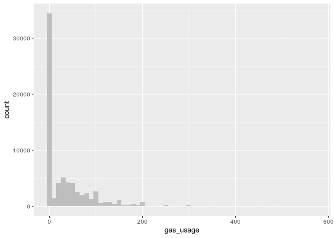

From the docs for `gas_usage`

| Value   | Definition                           |
|---------|--------------------------------------|
| NA      | Unknown or not applicable            |
| 001     | Included in rent or condo fee        |
| 002     | Included in electricity payment      |
| 003     | No charge or gas not used            |
| 004-999 | \$4 to \$999 (rounded and top-coded) |

### Density plots

``` r
library(scales)
ggplot(customer_data, aes(x = income)) +
  geom_density() +
  scale_x_continuous(labels = dollar)
```

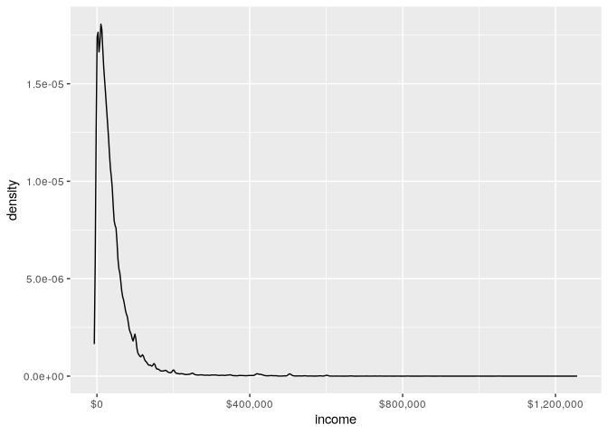

``` r
ggplot(customer_data, aes(x = income)) +
  geom_density() +
  scale_x_log10(breaks = c(10, 100, 1000, 10000, 100000),
                labels = dollar) +
  annotation_logticks(sides = "bt", color = "grey")
```

    Warning in transformation$transform(x): NaNs produced

    Warning in scale_x_log10(breaks = c(10, 100, 1000, 10000, 1e+05), labels =
    dollar): log-10 transformation introduced infinite values.

    Warning: Removed 6856 rows containing non-finite outside the scale range
    (`stat_density()`).

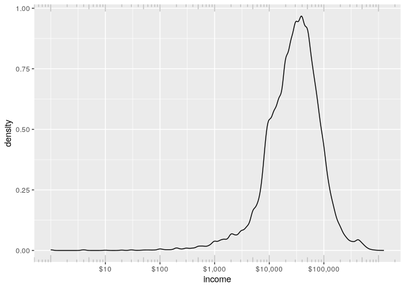

### Bar charts and dot plots

``` r
ggplot(customer_data, aes(x = state_of_res)) +
  geom_bar(fill = "purple") +
  coord_flip()
```

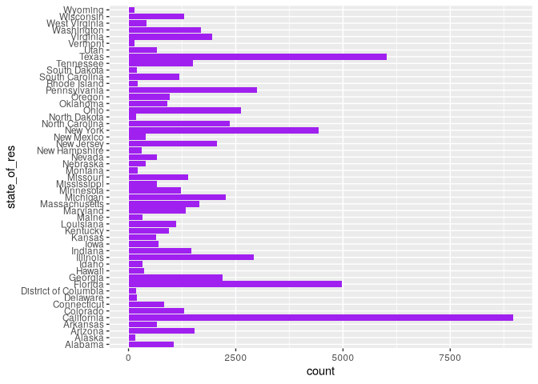

``` r
library(WVPlots)
ClevelandDotPlot(customer_data, "state_of_res",
                 sort = 1, title = "Customers by state") +
  coord_flip()
```

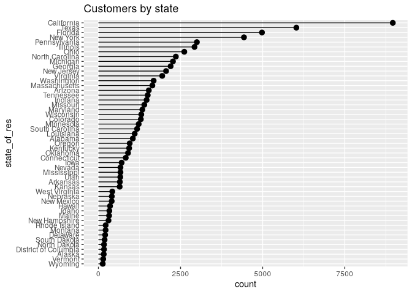

## Relationship between two variables

| Graph type | Uses | Examples |
|----|----|----|
| Line plot | Shows the relationship between two continuous variables. Best when that relationship is functional, or nearly so. | Plot y = f(x). |
| Scatter plot | Shows the relationship between two continuous variables. Best when the relationship is too loose or cloud-like to be easily seen on a line plot. | Plot income vs. years in the work- force (income on the y-axis). |
| Smoothing curve | Shows underlying “average” relation- ship, or trend, between two continu- ous variables. Can also be used to show the relationship between a con- tinuous and a binary or Boolean vari- able: the fraction of true values of the discrete variable as a function of the continuous variable. | Estimate the “average” relationship of income to years in the work- force. |
| Hexbin plot | Shows the relationship between two continuous variables when the data is very dense. | Plot income vs. years in the work- force for a large population. |
| Stacked bar chart | Shows the relationship between two categorical variables (var1 and var2). Highlights the frequencies of each value of var1. Works best when var2 is binary. | Plot insurance coverage (var2) as a function of marital status (var1) when you wish to retain information about the number of people in each marital category. |
| Side-by-side bar chart | Shows the relationship between two categorical variables (var1 and var2). Good for comparing the fre- quencies of each value of var2 across the values of var1. Works best when var2 is binary. | Plot insurance coverage (var2) as a function of marital status (var1) when you wish to directly compare the number of insured and unin- sured people in each marital category. |
| Shadow plot | Shows the relationship between two categorical variables (var1 and var2). Displays the frequency of each value of var1, while allowing comparison of var2 values both within and across the categories of var1. | Plot insurance coverage (var2) as a function of marital status (var1) when you wish to directly compare the number of insured and unin- sured people in each marital cate- gory and still retain information about the total number of people in each marital category. |
| Filled bar chart | Shows the relationship between two categorical variables (var1 and var2). Good for comparing the rela- tive frequencies of each value of var2 within each value of var1. Works best when var2 is binary. | Plot insurance coverage (var2) as a function of marital status (var1) when you wish to compare the ratio of uninsured to insured people in each marital category. |
| Bar chart with faceting | Shows the relationship between two categorical variables (var1 and var2). Best for comparing the rela- tive frequencies of each value of var2 within each value of var1 when var2 takes on more than two values. | Plot the distribution of marital sta- tus (var2) as a function of housing type (var1). |

### Scatter plots and smoothing curves

``` r
customer_data2 <- subset(
  customer_data,
  age > 0 & age < 100 &
    income > 0 & income < 200000
)
cor(customer_data2$age, customer_data2$income)
```

    [1] 0.005766697

This suggests little correlation, but perhaps this is misleading.

``` r
library(dplyr)
set.seed(245566)
customer_data_samp <- sample_frac(
  customer_data2, size = 0.1, replace = F)
ggplot(customer_data_samp, aes(x = age, y = income)) +
  geom_point() +
  geom_smooth() +
  ggtitle("Income as a function of age")
```

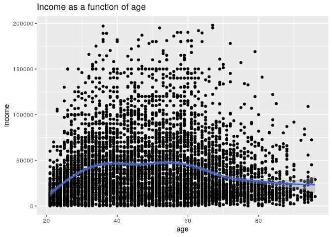

``` r
WVPlots::BinaryYScatterPlot(
  customer_data_samp, "age", "health_ins",
  title = "Probability of health insurance by age")
```

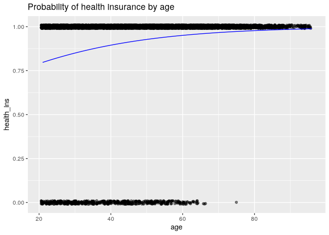

### Hexbin plots

``` r
WVPlots::HexBinPlot(
  customer_data2, "age", "income",
  "Income as a function of age") +
  geom_smooth(color = "black", se = F)
```

    `geom_smooth()` using method = 'gam' and formula = 'y ~ s(x, bs = "cs")'

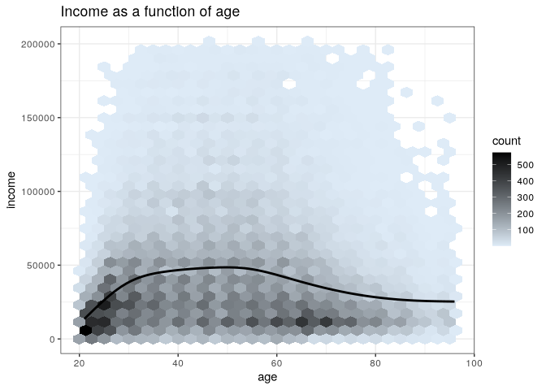

### Bar charts for 2 categorical variables

Stacked by default

``` r
ggplot(customer_data, aes(x=marital_status, fill=health_ins)) +
  geom_bar()
```

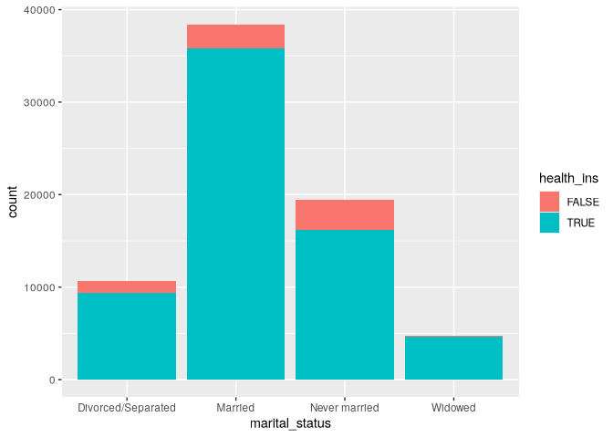

Side-by-side

``` r
ggplot(customer_data, aes(x=marital_status, fill=health_ins)) +
  geom_bar(position = "dodge")
```

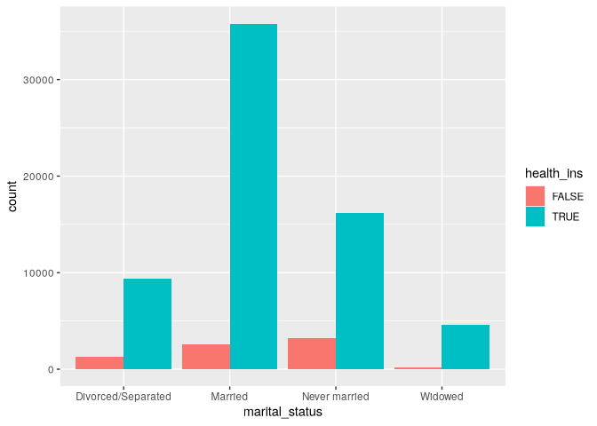

Shadow plot

``` r
WVPlots::ShadowPlot(
  customer_data, "marital_status", "health_ins",
  title = "Health insurance status by marital status")
```

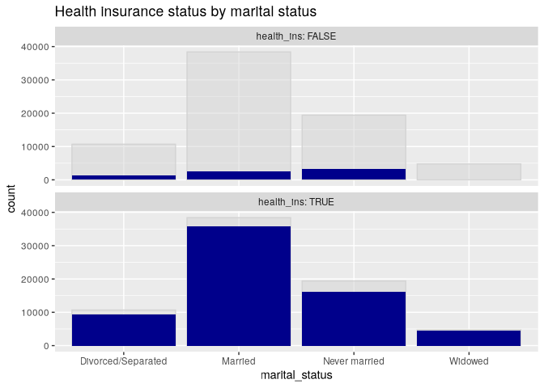

Filled bar chart

``` r
ggplot(customer_data, aes(x = marital_status, fill = health_ins)) +
  geom_bar(position = "fill")
```

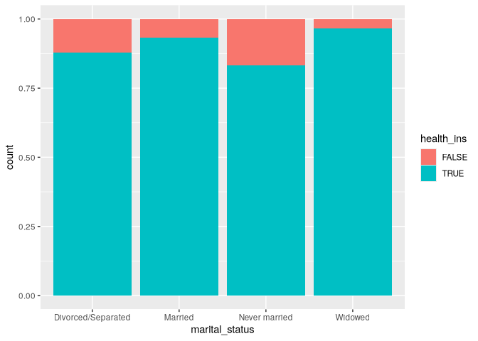

With and without facets

``` r
cdata <- subset(customer_data, !is.na(housing_type))
```

### Side-by-side bar

``` r
ggplot(cdata, aes(x = housing_type, fill = marital_status)) +
  geom_bar(position = "dodge") +
  scale_fill_brewer(palette = "Dark2") +
  coord_flip()
```

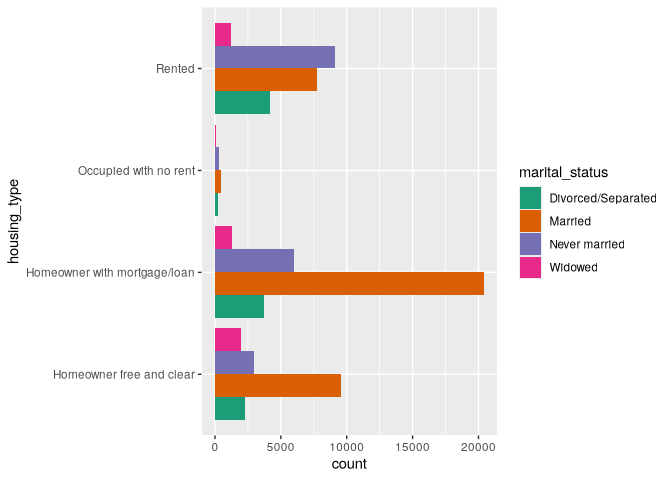

``` r
ggplot(cdata, aes(x = marital_status)) +
  geom_bar(fill = "darkgrey") +
  facet_wrap(~ housing_type, scale = "free_x") +
  coord_flip()
```

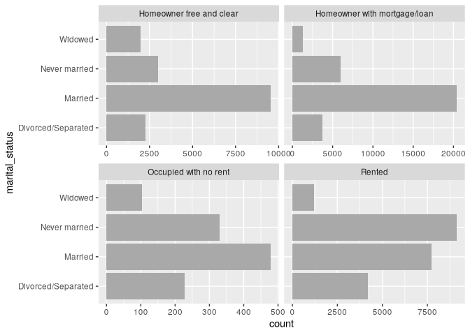

### Comparing continuous and categorical

``` r
customer_data3 <- subset(customer_data2, 
                         marital_status %in% c("Never married",
                                               "Widowed"))
ggplot(customer_data3, aes(x = age, color = marital_status,
                           linetype = marital_status)) +
  geom_density() +
  scale_color_brewer(palette = "Dark2")
```

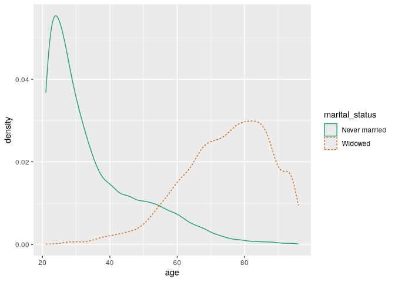

The problem with the plot is that it gives the impression that each
group are the same size.

``` r
ShadowHist(customer_data3, "age", "marital_status",
           "Age distribution for not married populations",
           binwidth = 5)
```

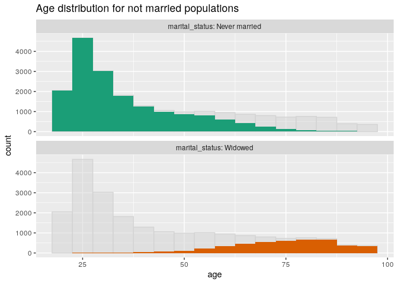

For more than 2 categories, must use facet wraps

``` r
ggplot(customer_data2, aes(x = age)) +
  geom_density() +
  facet_wrap(~marital_status)
```

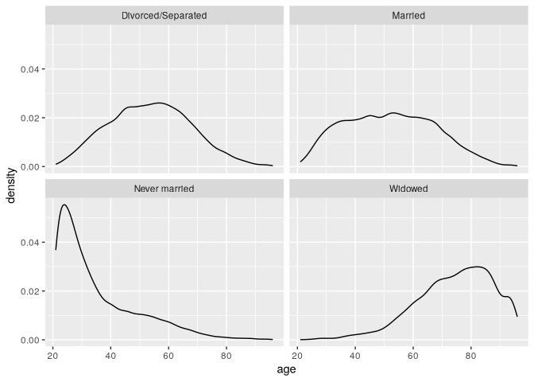
