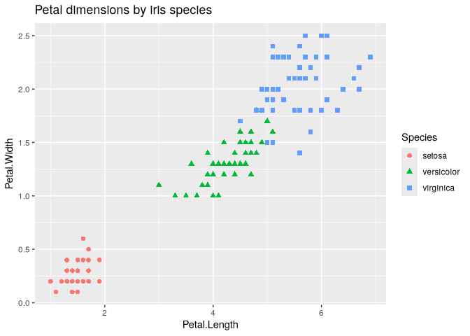
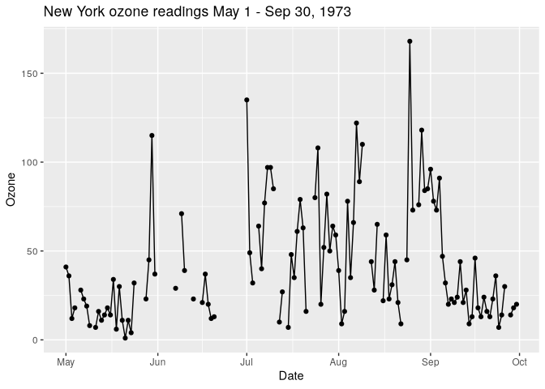
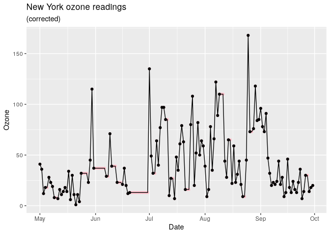
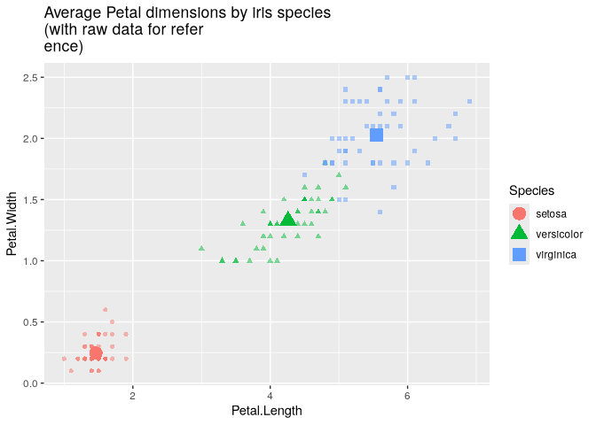
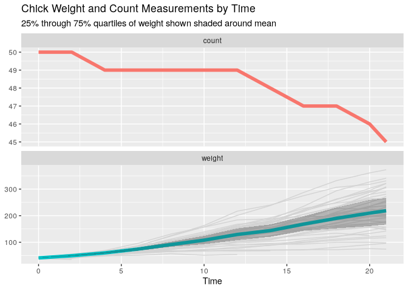

# Engineering and shaping data


# Data selection

## Subsetting rows and columns

``` r
library(ggplot2)
library(magrittr)
summary(iris)
```

      Sepal.Length    Sepal.Width     Petal.Length    Petal.Width   
     Min.   :4.300   Min.   :2.000   Min.   :1.000   Min.   :0.100  
     1st Qu.:5.100   1st Qu.:2.800   1st Qu.:1.600   1st Qu.:0.300  
     Median :5.800   Median :3.000   Median :4.350   Median :1.300  
     Mean   :5.843   Mean   :3.057   Mean   :3.758   Mean   :1.199  
     3rd Qu.:6.400   3rd Qu.:3.300   3rd Qu.:5.100   3rd Qu.:1.800  
     Max.   :7.900   Max.   :4.400   Max.   :6.900   Max.   :2.500  
           Species  
     setosa    :50  
     versicolor:50  
     virginica :50  
                    
                    
                    

``` r
head(iris)
```

      Sepal.Length Sepal.Width Petal.Length Petal.Width Species
    1          5.1         3.5          1.4         0.2  setosa
    2          4.9         3.0          1.4         0.2  setosa
    3          4.7         3.2          1.3         0.2  setosa
    4          4.6         3.1          1.5         0.2  setosa
    5          5.0         3.6          1.4         0.2  setosa
    6          5.4         3.9          1.7         0.4  setosa

``` r
ggplot(iris, aes(x = Petal.Length, y = Petal.Width)) +
  geom_point(aes(color = Species, shape = Species), size = 2) +
  ggtitle("Petal dimensions by iris species")
```



Suppose we are assigned to generate a report on only petal length and
petal width, by iris species, for irises where the petal length is
greater than 2.

> With R

``` r
iris[iris$Petal.Length > 2, c("Petal.Length", "Petal.Width", "Species")] %>% 
  head()
```

       Petal.Length Petal.Width    Species
    51          4.7         1.4 versicolor
    52          4.5         1.5 versicolor
    53          4.9         1.5 versicolor
    54          4.0         1.3 versicolor
    55          4.6         1.5 versicolor
    56          4.5         1.3 versicolor

> With `data.table`

``` r
library(data.table)
iris_dt <- as.data.table(iris)

cols <- c("Petal.Length", "Petal.Width", "Species")
iris_dt <- iris_dt[iris_dt$Petal.Length > 2, ..cols]
head(iris_dt)
```

       Petal.Length Petal.Width    Species
              <num>       <num>     <fctr>
    1:          4.7         1.4 versicolor
    2:          4.5         1.5 versicolor
    3:          4.9         1.5 versicolor
    4:          4.0         1.3 versicolor
    5:          4.6         1.5 versicolor
    6:          4.5         1.3 versicolor

> `dplyr`

``` r
library(dplyr)
iris_dplyr <- iris %>% 
  select(., Petal.Length, Petal.Width, Species) %>% 
  filter(., Petal.Length > 2)
head(iris_dplyr)
```

      Petal.Length Petal.Width    Species
    1          4.7         1.4 versicolor
    2          4.5         1.5 versicolor
    3          4.9         1.5 versicolor
    4          4.0         1.3 versicolor
    5          4.6         1.5 versicolor
    6          4.5         1.3 versicolor

## Removing incomplete records

``` r
str(msleep)
```

    tibble [83 × 11] (S3: tbl_df/tbl/data.frame)
     $ name        : chr [1:83] "Cheetah" "Owl monkey" "Mountain beaver" "Greater short-tailed shrew" ...
     $ genus       : chr [1:83] "Acinonyx" "Aotus" "Aplodontia" "Blarina" ...
     $ vore        : chr [1:83] "carni" "omni" "herbi" "omni" ...
     $ order       : chr [1:83] "Carnivora" "Primates" "Rodentia" "Soricomorpha" ...
     $ conservation: chr [1:83] "lc" NA "nt" "lc" ...
     $ sleep_total : num [1:83] 12.1 17 14.4 14.9 4 14.4 8.7 7 10.1 3 ...
     $ sleep_rem   : num [1:83] NA 1.8 2.4 2.3 0.7 2.2 1.4 NA 2.9 NA ...
     $ sleep_cycle : num [1:83] NA NA NA 0.133 0.667 ...
     $ awake       : num [1:83] 11.9 7 9.6 9.1 20 9.6 15.3 17 13.9 21 ...
     $ brainwt     : num [1:83] NA 0.0155 NA 0.00029 0.423 NA NA NA 0.07 0.0982 ...
     $ bodywt      : num [1:83] 50 0.48 1.35 0.019 600 ...

``` r
summary(msleep)
```

         name              genus               vore              order          
     Length:83          Length:83          Length:83          Length:83         
     Class :character   Class :character   Class :character   Class :character  
     Mode  :character   Mode  :character   Mode  :character   Mode  :character  
                                                                                
                                                                                
                                                                                
                                                                                
     conservation        sleep_total      sleep_rem      sleep_cycle    
     Length:83          Min.   : 1.90   Min.   :0.100   Min.   :0.1167  
     Class :character   1st Qu.: 7.85   1st Qu.:0.900   1st Qu.:0.1833  
     Mode  :character   Median :10.10   Median :1.500   Median :0.3333  
                        Mean   :10.43   Mean   :1.875   Mean   :0.4396  
                        3rd Qu.:13.75   3rd Qu.:2.400   3rd Qu.:0.5792  
                        Max.   :19.90   Max.   :6.600   Max.   :1.5000  
                                        NA's   :22      NA's   :51      
         awake          brainwt            bodywt        
     Min.   : 4.10   Min.   :0.00014   Min.   :   0.005  
     1st Qu.:10.25   1st Qu.:0.00290   1st Qu.:   0.174  
     Median :13.90   Median :0.01240   Median :   1.670  
     Mean   :13.57   Mean   :0.28158   Mean   : 166.136  
     3rd Qu.:16.15   3rd Qu.:0.12550   3rd Qu.:  41.750  
     Max.   :22.10   Max.   :5.71200   Max.   :6654.000  
                     NA's   :27                          

Remove all rows with missing values

> Base R

``` r
# clean_base_1 <- msleep[complete.cases(msleep), , drop = FALSE]
clean_base_2 <- na.omit(msleep)
head(clean_base_2)
```

    # A tibble: 6 × 11
      name    genus vore  order conservation sleep_total sleep_rem sleep_cycle awake
      <chr>   <chr> <chr> <chr> <chr>              <dbl>     <dbl>       <dbl> <dbl>
    1 Greate… Blar… omni  Sori… lc                  14.9       2.3       0.133   9.1
    2 Cow     Bos   herbi Arti… domesticated         4         0.7       0.667  20  
    3 Dog     Canis carni Carn… domesticated        10.1       2.9       0.333  13.9
    4 Guinea… Cavis herbi Rode… domesticated         9.4       0.8       0.217  14.6
    5 Chinch… Chin… herbi Rode… domesticated        12.5       1.5       0.117  11.5
    6 Lesser… Cryp… omni  Sori… lc                   9.1       1.4       0.15   14.9
    # ℹ 2 more variables: brainwt <dbl>, bodywt <dbl>

``` r
nrow(clean_base_2)
```

    [1] 20

> `data.table`

``` r
msleep_dt <- as.data.table(msleep)
clean_dt <- msleep_dt[complete.cases(msleep_dt),]
nrow(clean_dt)
```

    [1] 20

> `dplyr`

``` r
clean_dplyr <- msleep %>% 
  filter(., complete.cases(.))
nrow(clean_dplyr)
```

    [1] 20

## Ordering rows

``` r
purchases <- data.frame(
  day = c(1, 2, 2, 1, 2, 1),
  hour = c(9, 9, 11, 13, 13, 14),
  n_purchase = c(5, 3, 5, 1, 3, 1)
)
```

Order by hour and compute running sum

> base R

``` r
idx <- with(purchases, order(day, hour))
purchases_ordered <- purchases[idx, , drop = F]
purchases_ordered$running_total <- cumsum(purchases_ordered$n_purchase)
head(purchases_ordered)
```

      day hour n_purchase running_total
    1   1    9          5             5
    4   1   13          1             6
    6   1   14          1             7
    2   2    9          3            10
    3   2   11          5            15
    5   2   13          3            18

> `data.table`

``` r
purchases_dt <- as.data.table(purchases)
setorderv(purchases_dt, c("day", "hour"))
purchases_dt[, running_total := cumsum(n_purchase)]
head(purchases_dt)
```

         day  hour n_purchase running_total
       <num> <num>      <num>         <num>
    1:     1     9          5             5
    2:     1    13          1             6
    3:     1    14          1             7
    4:     2     9          3            10
    5:     2    11          5            15
    6:     2    13          3            18

> `dplyr`

``` r
purchases %>% 
  arrange(day, hour) %>% 
  mutate(running_total = cumsum(n_purchase))
```

      day hour n_purchase running_total
    1   1    9          5             5
    2   1   13          1             6
    3   1   14          1             7
    4   2    9          3            10
    5   2   11          5            15
    6   2   13          3            18

**Calculate the running total per day**

> R base

Too complicated

> `data.table`

``` r
purchases_dt <- as.data.table(purchases)
purchases_dt[order(day, hour),
             .(hour = hour,
               n_purchase = n_purchase,
               running_total = cumsum(n_purchase)),
             by = day]
```

         day  hour n_purchase running_total
       <num> <num>      <num>         <num>
    1:     1     9          5             5
    2:     1    13          1             6
    3:     1    14          1             7
    4:     2     9          3             3
    5:     2    11          5             8
    6:     2    13          3            11

``` r
setorderv(purchases_dt, c("day", "hour"))
purchases_dt[, running_total := cumsum(n_purchase), by = day]
head(purchases_dt)
```

         day  hour n_purchase running_total
       <num> <num>      <num>         <num>
    1:     1     9          5             5
    2:     1    13          1             6
    3:     1    14          1             7
    4:     2     9          3             3
    5:     2    11          5             8
    6:     2    13          3            11

Without reordering the table

``` r
purchases_dt <- as.data.table(purchases)
purchases_dt[order(day, hour),
             `:=`(hour = hour,
                  n_purchase = n_purchase,
                  running_total = cumsum(n_purchase)),
             by = day]
head(purchases_dt)
```

         day  hour n_purchase running_total
       <num> <num>      <num>         <num>
    1:     1     9          5             5
    2:     2     9          3             3
    3:     2    11          5             8
    4:     1    13          1             6
    5:     2    13          3            11
    6:     1    14          1             7

> `dpylr`

``` r
purchases %>% 
  arrange(day, hour) %>% 
  group_by(day) %>% 
  mutate(running_total = cumsum(n_purchase)) %>% 
  ungroup()
```

    # A tibble: 6 × 4
        day  hour n_purchase running_total
      <dbl> <dbl>      <dbl>         <dbl>
    1     1     9          5             5
    2     1    13          1             6
    3     1    14          1             7
    4     2     9          3             3
    5     2    11          5             8
    6     2    13          3            11

# Basic data transforms

``` r
library(datasets)
summary(airquality)
```

         Ozone           Solar.R           Wind             Temp      
     Min.   :  1.00   Min.   :  7.0   Min.   : 1.700   Min.   :56.00  
     1st Qu.: 18.00   1st Qu.:115.8   1st Qu.: 7.400   1st Qu.:72.00  
     Median : 31.50   Median :205.0   Median : 9.700   Median :79.00  
     Mean   : 42.13   Mean   :185.9   Mean   : 9.958   Mean   :77.88  
     3rd Qu.: 63.25   3rd Qu.:258.8   3rd Qu.:11.500   3rd Qu.:85.00  
     Max.   :168.00   Max.   :334.0   Max.   :20.700   Max.   :97.00  
     NA's   :37       NA's   :7                                       
         Month            Day      
     Min.   :5.000   Min.   : 1.0  
     1st Qu.:6.000   1st Qu.: 8.0  
     Median :7.000   Median :16.0  
     Mean   :6.993   Mean   :15.8  
     3rd Qu.:8.000   3rd Qu.:23.0  
     Max.   :9.000   Max.   :31.0  
                                   

## Create a date column

> base R

``` r
library(lubridate)
datestr <-  function(day, month, year) {
  paste(day, month, year, sep="-")
  }
airquality_with_date <- airquality
airquality_with_date$date <- with(airquality_with_date,
                                  dmy(datestr(Day, Month, 1973)))
airquality_with_date[, c("Ozone", "date"), drop = F] %>% head()
```

      Ozone       date
    1    41 1973-05-01
    2    36 1973-05-02
    3    12 1973-05-03
    4    18 1973-05-04
    5    NA 1973-05-05
    6    28 1973-05-06

``` r
ggplot(airquality_with_date, aes(x = date, y = Ozone)) +
  geom_point() +
  geom_line() +
  xlab("Date") +
  ggtitle("New York ozone readings May 1 - Sep 30, 1973")
```

    Warning: Removed 37 rows containing missing values or values outside the scale range
    (`geom_point()`).



> `data.table`

``` r
airquality_dt <- as.data.table(airquality)
airquality_dt[
  , date := dmy(datestr(Day, Month, 1973))][
    , c("Ozone", "date")
  ]
```

         Ozone       date
         <int>     <Date>
      1:    41 1973-05-01
      2:    36 1973-05-02
      3:    12 1973-05-03
      4:    18 1973-05-04
      5:    NA 1973-05-05
     ---                 
    149:    30 1973-09-26
    150:    NA 1973-09-27
    151:    14 1973-09-28
    152:    18 1973-09-29
    153:    20 1973-09-30

> `dplyr`

``` r
airquality_with_date2 <- airquality %>% 
  mutate(date = dmy(datestr(Day, Month, 1973))) %>% 
  select(Ozone, date)
head(airquality_with_date2)
```

      Ozone       date
    1    41 1973-05-01
    2    36 1973-05-02
    3    12 1973-05-03
    4    18 1973-05-04
    5    NA 1973-05-05
    6    28 1973-05-06

## Impute NAs

Propagate the last known Ozone reading forward

> Base R `na.locf()`

``` r
library(zoo)
airquality_corrected <- airquality_with_date
airquality_corrected$OzoneCorrected <- 
  na.locf(airquality_corrected$Ozone, na.rm = F)
summary(airquality_corrected)
```

         Ozone           Solar.R           Wind             Temp      
     Min.   :  1.00   Min.   :  7.0   Min.   : 1.700   Min.   :56.00  
     1st Qu.: 18.00   1st Qu.:115.8   1st Qu.: 7.400   1st Qu.:72.00  
     Median : 31.50   Median :205.0   Median : 9.700   Median :79.00  
     Mean   : 42.13   Mean   :185.9   Mean   : 9.958   Mean   :77.88  
     3rd Qu.: 63.25   3rd Qu.:258.8   3rd Qu.:11.500   3rd Qu.:85.00  
     Max.   :168.00   Max.   :334.0   Max.   :20.700   Max.   :97.00  
     NA's   :37       NA's   :7                                       
         Month            Day            date            OzoneCorrected  
     Min.   :5.000   Min.   : 1.0   Min.   :1973-05-01   Min.   :  1.00  
     1st Qu.:6.000   1st Qu.: 8.0   1st Qu.:1973-06-08   1st Qu.: 16.00  
     Median :7.000   Median :16.0   Median :1973-07-16   Median : 30.00  
     Mean   :6.993   Mean   :15.8   Mean   :1973-07-16   Mean   : 39.78  
     3rd Qu.:8.000   3rd Qu.:23.0   3rd Qu.:1973-08-23   3rd Qu.: 52.00  
     Max.   :9.000   Max.   :31.0   Max.   :1973-09-30   Max.   :168.00  
                                                                         

``` r
ggplot(airquality_corrected, aes(x = date, y = Ozone)) +
  geom_point(aes(y = OzoneCorrected), colour = "pink") +
  geom_point(aes(y = Ozone)) +
  geom_line(aes(y = OzoneCorrected)) +
  ggtitle("New York ozone readings", subtitle = "(corrected)") +
  xlab("Date")
```

    Warning: Removed 37 rows containing missing values or values outside the scale range
    (`geom_point()`).



> `data.table`

``` r
airquality_dt[, OzoneCorrected := na.locf(Ozone, na.rm = F)]
summary(airquality_dt)
```

         Ozone           Solar.R           Wind             Temp      
     Min.   :  1.00   Min.   :  7.0   Min.   : 1.700   Min.   :56.00  
     1st Qu.: 18.00   1st Qu.:115.8   1st Qu.: 7.400   1st Qu.:72.00  
     Median : 31.50   Median :205.0   Median : 9.700   Median :79.00  
     Mean   : 42.13   Mean   :185.9   Mean   : 9.958   Mean   :77.88  
     3rd Qu.: 63.25   3rd Qu.:258.8   3rd Qu.:11.500   3rd Qu.:85.00  
     Max.   :168.00   Max.   :334.0   Max.   :20.700   Max.   :97.00  
     NA's   :37       NA's   :7                                       
         Month            Day            date            OzoneCorrected  
     Min.   :5.000   Min.   : 1.0   Min.   :1973-05-01   Min.   :  1.00  
     1st Qu.:6.000   1st Qu.: 8.0   1st Qu.:1973-06-08   1st Qu.: 16.00  
     Median :7.000   Median :16.0   Median :1973-07-16   Median : 30.00  
     Mean   :6.993   Mean   :15.8   Mean   :1973-07-16   Mean   : 39.78  
     3rd Qu.:8.000   3rd Qu.:23.0   3rd Qu.:1973-08-23   3rd Qu.: 52.00  
     Max.   :9.000   Max.   :31.0   Max.   :1973-09-30   Max.   :168.00  
                                                                         

> `dplyr`

``` r
airquality_with_date %>% 
  mutate(OzoneCorrected = na.locf(Ozone, na.rm = F)) %>% 
  summary()
```

         Ozone           Solar.R           Wind             Temp      
     Min.   :  1.00   Min.   :  7.0   Min.   : 1.700   Min.   :56.00  
     1st Qu.: 18.00   1st Qu.:115.8   1st Qu.: 7.400   1st Qu.:72.00  
     Median : 31.50   Median :205.0   Median : 9.700   Median :79.00  
     Mean   : 42.13   Mean   :185.9   Mean   : 9.958   Mean   :77.88  
     3rd Qu.: 63.25   3rd Qu.:258.8   3rd Qu.:11.500   3rd Qu.:85.00  
     Max.   :168.00   Max.   :334.0   Max.   :20.700   Max.   :97.00  
     NA's   :37       NA's   :7                                       
         Month            Day            date            OzoneCorrected  
     Min.   :5.000   Min.   : 1.0   Min.   :1973-05-01   Min.   :  1.00  
     1st Qu.:6.000   1st Qu.: 8.0   1st Qu.:1973-06-08   1st Qu.: 16.00  
     Median :7.000   Median :16.0   Median :1973-07-16   Median : 30.00  
     Mean   :6.993   Mean   :15.8   Mean   :1973-07-16   Mean   : 39.78  
     3rd Qu.:8.000   3rd Qu.:23.0   3rd Qu.:1973-08-23   3rd Qu.: 52.00  
     Max.   :9.000   Max.   :31.0   Max.   :1973-09-30   Max.   :168.00  
                                                                         

# Aggregating transforms

Summarizing rows

> Base R

``` r
(iris_summary <- aggregate(
  cbind(Petal.Length, Petal.Width) ~ Species,
  data = iris, FUN = mean))
```

         Species Petal.Length Petal.Width
    1     setosa        1.462       0.246
    2 versicolor        4.260       1.326
    3  virginica        5.552       2.026

``` r
ggplot(mapping = aes(x = Petal.Length, y = Petal.Width, 
           shape = Species, color = Species)) +
  geom_point(data = iris, alpha = 0.5) +
  geom_point(data = iris_summary, size = 5) +
  ggtitle("Average Petal dimensions by iris species\n(with raw data for refer
ence)")
```



> `data.table`

``` r
iris_dt <- as.data.table(iris)
iris_dt[, .(Petal.Length = mean(Petal.Length),
            Petal.Width = mean(Petal.Width)),
        by = .(Species)]
```

          Species Petal.Length Petal.Width
           <fctr>        <num>       <num>
    1:     setosa        1.462       0.246
    2: versicolor        4.260       1.326
    3:  virginica        5.552       2.026

> `dplyr`

``` r
iris %>% 
  group_by(Species) %>% 
  summarize(Petal.Length = mean(Petal.Length),
            Petal.Width = mean(Petal.Width)) %>% 
  ungroup()
```

    # A tibble: 3 × 3
      Species    Petal.Length Petal.Width
      <fct>             <dbl>       <dbl>
    1 setosa             1.46       0.246
    2 versicolor         4.26       1.33 
    3 virginica          5.55       2.03 

Adding the calculated values as columns

``` r
iris_copy <- iris
iris_copy$mean_Petal.Length <- 
  ave(iris$Petal.Length, iris$Species, FUN = mean)
iris_copy$mean_Petal.Width <- 
  ave(iris$Petal.Width, iris$Species, FUN = mean)
head(iris_copy)
```

      Sepal.Length Sepal.Width Petal.Length Petal.Width Species mean_Petal.Length
    1          5.1         3.5          1.4         0.2  setosa             1.462
    2          4.9         3.0          1.4         0.2  setosa             1.462
    3          4.7         3.2          1.3         0.2  setosa             1.462
    4          4.6         3.1          1.5         0.2  setosa             1.462
    5          5.0         3.6          1.4         0.2  setosa             1.462
    6          5.4         3.9          1.7         0.4  setosa             1.462
      mean_Petal.Width
    1            0.246
    2            0.246
    3            0.246
    4            0.246
    5            0.246
    6            0.246

``` r
iris_copy[floor(runif(10, 1, 200)),]
```

        Sepal.Length Sepal.Width Petal.Length Petal.Width    Species
    121          6.9         3.2          5.7         2.3  virginica
    51           7.0         3.2          4.7         1.4 versicolor
    102          5.8         2.7          5.1         1.9  virginica
    23           4.6         3.6          1.0         0.2     setosa
    147          6.3         2.5          5.0         1.9  virginica
    4            4.6         3.1          1.5         0.2     setosa
    48           4.6         3.2          1.4         0.2     setosa
    49           5.3         3.7          1.5         0.2     setosa
    120          6.0         2.2          5.0         1.5  virginica
    NA            NA          NA           NA          NA       <NA>
        mean_Petal.Length mean_Petal.Width
    121             5.552            2.026
    51              4.260            1.326
    102             5.552            2.026
    23              1.462            0.246
    147             5.552            2.026
    4               1.462            0.246
    48              1.462            0.246
    49              1.462            0.246
    120             5.552            2.026
    NA                 NA               NA

> `data.table`

``` r
iris_dt <- as.data.table(iris)
iris_dt[, `:=`(mean_Petal.Length = mean(Petal.Length),
               mean_Petal.Width = mean(Petal.Width)),
        by = "Species"]
iris_dt[floor(runif(10, 1, 200)),]
```

        Sepal.Length Sepal.Width Petal.Length Petal.Width    Species
               <num>       <num>        <num>       <num>     <fctr>
     1:          6.3         2.8          5.1         1.5  virginica
     2:          6.5         3.0          5.2         2.0  virginica
     3:          4.3         3.0          1.1         0.1     setosa
     4:          6.7         3.1          5.6         2.4  virginica
     5:           NA          NA           NA          NA       <NA>
     6:          5.1         2.5          3.0         1.1 versicolor
     7:          6.3         3.3          4.7         1.6 versicolor
     8:          5.2         4.1          1.5         0.1     setosa
     9:          5.7         4.4          1.5         0.4     setosa
    10:           NA          NA           NA          NA       <NA>
        mean_Petal.Length mean_Petal.Width
                    <num>            <num>
     1:             5.552            2.026
     2:             5.552            2.026
     3:             1.462            0.246
     4:             5.552            2.026
     5:                NA               NA
     6:             4.260            1.326
     7:             4.260            1.326
     8:             1.462            0.246
     9:             1.462            0.246
    10:                NA               NA

> `dplyr`

``` r
iris %>% 
  group_by(Species) %>% 
  mutate(
    mean_Petal.Length = mean(Petal.Length),
    mean_Petal.Width = mean(Petal.Width)
  ) %>% 
  ungroup() %>% 
  head()
```

    # A tibble: 6 × 7
      Sepal.Length Sepal.Width Petal.Length Petal.Width Species mean_Petal.Length
             <dbl>       <dbl>        <dbl>       <dbl> <fct>               <dbl>
    1          5.1         3.5          1.4         0.2 setosa               1.46
    2          4.9         3            1.4         0.2 setosa               1.46
    3          4.7         3.2          1.3         0.2 setosa               1.46
    4          4.6         3.1          1.5         0.2 setosa               1.46
    5          5           3.6          1.4         0.2 setosa               1.46
    6          5.4         3.9          1.7         0.4 setosa               1.46
    # ℹ 1 more variable: mean_Petal.Width <dbl>

# Multitable transforms

## Combining ordered data frames

``` r
product_table <- data.frame(
  product_id = c("p1", "p2", "p3", "p4", "p5"),
  price = c(9.99, 16.29, 19.99, 5.49, 24.49)
)

sales_table <- data.frame(
  product_id = c("p1", "p2", "p3", "p4", "p5"),
  sold_store = c(6, 31, 30, 31, 43),
  sold_online = c(64, 1, 23, 67, 51)
)

product_table_2 <- data.frame(
  product_id = c("n1", "n2", "n3"),
  price = c(25.49, 33.99, 17.99)
)

product_table$product_id <- as.factor(product_table$product_id)
product_table_2$product_id <- as.factor(product_table_2$product_id)
```

### Appending rows

> Base R

``` r
rbind(product_table, product_table_2)
```

      product_id price
    1         p1  9.99
    2         p2 16.29
    3         p3 19.99
    4         p4  5.49
    5         p5 24.49
    6         n1 25.49
    7         n2 33.99
    8         n3 17.99

> `data.table`

``` r
rbindlist(list(product_table, product_table_2))
```

       product_id price
           <fctr> <num>
    1:         p1  9.99
    2:         p2 16.29
    3:         p3 19.99
    4:         p4  5.49
    5:         p5 24.49
    6:         n1 25.49
    7:         n2 33.99
    8:         n3 17.99

> `dplyr`

``` r
bind_rows(list(product_table, product_table_2))
```

      product_id price
    1         p1  9.99
    2         p2 16.29
    3         p3 19.99
    4         p4  5.49
    5         p5 24.49
    6         n1 25.49
    7         n2 33.99
    8         n3 17.99

### Splitting tables

Add an extra extra column with the name of the source table

``` r
product_table_marked <- product_table
product_table_marked$table <- "product_table"
product_table_2_marked <- product_table_2
product_table_2_marked$table <- "product_table_2"
rbind_base <- rbind(product_table_marked, product_table_2_marked)
```

Split them apart

``` r
split(rbind_base, rbind_base$table)
```

    $product_table
      product_id price         table
    1         p1  9.99 product_table
    2         p2 16.29 product_table
    3         p3 19.99 product_table
    4         p4  5.49 product_table
    5         p5 24.49 product_table

    $product_table_2
      product_id price           table
    6         n1 25.49 product_table_2
    7         n2 33.99 product_table_2
    8         n3 17.99 product_table_2

> `data.table`

Calculate max price per group

``` r
rbind_base_dt <- as.data.table(rbind_base)
f <- function(.BY, .SD) {
  max(.SD$price)
}
rbind_base_dt[, max_price := f(.BY, .SD), by = table]
rbind_base_dt
```

       product_id price           table max_price
           <fctr> <num>          <char>     <num>
    1:         p1  9.99   product_table     24.49
    2:         p2 16.29   product_table     24.49
    3:         p3 19.99   product_table     24.49
    4:         p4  5.49   product_table     24.49
    5:         p5 24.49   product_table     24.49
    6:         n1 25.49 product_table_2     33.99
    7:         n2 33.99 product_table_2     33.99
    8:         n3 17.99 product_table_2     33.99

``` r
rbind_base_dt <- as.data.table(rbind_base)
grouping_column <- "table"
rbind_base_dt[, max_price := max(price), by = eval(grouping_column)]
rbind_base_dt
```

       product_id price           table max_price
           <fctr> <num>          <char>     <num>
    1:         p1  9.99   product_table     24.49
    2:         p2 16.29   product_table     24.49
    3:         p3 19.99   product_table     24.49
    4:         p4  5.49   product_table     24.49
    5:         p5 24.49   product_table     24.49
    6:         n1 25.49 product_table_2     33.99
    7:         n2 33.99 product_table_2     33.99
    8:         n3 17.99 product_table_2     33.99

``` r
rbind_base_dt <- as.data.table(rbind_base)
grouping_column <- "table"
rbind_base_dt[, max_price := max(price), by = grouping_column]
rbind_base_dt
```

       product_id price           table max_price
           <fctr> <num>          <char>     <num>
    1:         p1  9.99   product_table     24.49
    2:         p2 16.29   product_table     24.49
    3:         p3 19.99   product_table     24.49
    4:         p4  5.49   product_table     24.49
    5:         p5 24.49   product_table     24.49
    6:         n1 25.49 product_table_2     33.99
    7:         n2 33.99 product_table_2     33.99
    8:         n3 17.99 product_table_2     33.99

> `dplyr`

``` r
rbind_base %>% 
  group_by(table) %>% 
  mutate(max_price = max(price)) %>% 
  ungroup()
```

    # A tibble: 8 × 4
      product_id price table           max_price
      <fct>      <dbl> <chr>               <dbl>
    1 p1          9.99 product_table        24.5
    2 p2         16.3  product_table        24.5
    3 p3         20.0  product_table        24.5
    4 p4          5.49 product_table        24.5
    5 p5         24.5  product_table        24.5
    6 n1         25.5  product_table_2      34.0
    7 n2         34.0  product_table_2      34.0
    8 n3         18.0  product_table_2      34.0

### Appending columns

``` r
dim(sales_table)
```

    [1] 5 3

``` r
dim(product_table)
```

    [1] 5 2

``` r
cbind(product_table, sales_table[, -1])
```

      product_id price sold_store sold_online
    1         p1  9.99          6          64
    2         p2 16.29         31           1
    3         p3 19.99         30          23
    4         p4  5.49         31          67
    5         p5 24.49         43          51

> `data.table`

``` r
cbind(as.data.table(product_table),
      as.data.table(sales_table[, -1]))
```

       product_id price sold_store sold_online
           <fctr> <num>      <num>       <num>
    1:         p1  9.99          6          64
    2:         p2 16.29         31           1
    3:         p3 19.99         30          23
    4:         p4  5.49         31          67
    5:         p5 24.49         43          51

``` r
dplyr:: bind_cols(list(product_table, sales_table[, -1]))
```

      product_id price sold_store sold_online
    1         p1  9.99          6          64
    2         p2 16.29         31           1
    3         p3 19.99         30          23
    4         p4  5.49         31          67
    5         p5 24.49         43          51

## Joining tables

``` r
product_table_2 <- product_table[c(1, 3:5),]
sales_table_2 <- data.table(
  product_id = product_table[1:4, "product_id"],
  units_sold = c(10, 43, 55, 8)
)
product_table_2
```

      product_id price
    1         p1  9.99
    3         p3 19.99
    4         p4  5.49
    5         p5 24.49

``` r
sales_table_2
```

       product_id units_sold
           <fctr>      <num>
    1:         p1         10
    2:         p2         43
    3:         p3         55
    4:         p4          8

### Left join

> Base R

``` r
merge(product_table_2, sales_table_2,
      by = "product_id", all.x = T)
```

      product_id price units_sold
    1         p1  9.99         10
    2         p3 19.99         55
    3         p4  5.49          8
    4         p5 24.49         NA

> `data.table`

``` r
product_table_2_dt <- as.data.table(product_table_2)
sales_table_2_dt <- as.data.table(sales_table_2)
sales_table_2_dt[product_table_2_dt, on = "product_id"]
```

       product_id units_sold price
           <fctr>      <num> <num>
    1:         p1         10  9.99
    2:         p3         55 19.99
    3:         p4          8  5.49
    4:         p5         NA 24.49

Using indexing

``` r
joined_table <- product_table_2
joined_table$unitsSold <- sales_table_2$units_sold[match(joined_table$product_id,
                                                         sales_table_2$product_id)]
joined_table
```

      product_id price unitsSold
    1         p1  9.99        10
    3         p3 19.99        55
    4         p4  5.49         8
    5         p5 24.49        NA

``` r
left_join(product_table_2, sales_table_2)
```

    Joining with `by = join_by(product_id)`

      product_id price units_sold
    1         p1  9.99         10
    2         p3 19.99         55
    3         p4  5.49          8
    4         p5 24.49         NA

### Inner join

> Base R and `data.table`

``` r
merge(product_table_2, sales_table_2, by = "product_id")
```

      product_id price units_sold
    1         p1  9.99         10
    2         p3 19.99         55
    3         p4  5.49          8

> `dplyr`

``` r
inner_join(product_table_2, sales_table_2, by = "product_id")
```

      product_id price units_sold
    1         p1  9.99         10
    2         p3 19.99         55
    3         p4  5.49          8

### Full join

> Base R and `data.table`

``` r
merge(product_table_2, sales_table_2, by = "product_id", all = T)
```

      product_id price units_sold
    1         p1  9.99         10
    2         p2    NA         43
    3         p3 19.99         55
    4         p4  5.49          8
    5         p5 24.49         NA

``` r
full_join(product_table_2, sales_table_2, by = "product_id")
```

      product_id price units_sold
    1         p1  9.99         10
    2         p3 19.99         55
    3         p4  5.49          8
    4         p5 24.49         NA
    5         p2    NA         43

### Rolling joins with `data.table`

A rolling join is a type of join on an ordered column that gives us the
most recent data available at the lookup time.

You are given historic stock trade and quote (bid/ask) data. You are
asked to perform the following analyses on the stock data: find what the
bid and ask price were current when each trade was performed. This
involves using row order to indicate time, and sharing information
between rows.

``` r
quotes <- data.table(
  bid = c(5, 5, 7, 8),
  ask = c(6, 6, 8, 10),
  bid_quantity = c(100, 100, 100, 100),
  ask_quantity = c(100, 100, 100, 100),
  when = as.POSIXct(strptime(
    c("2018-10-18 1:03:17",
      "2018-10-18 2:12:23",
      "2018-10-18 2:15:00",
      "2018-10-18 2:17:51"),
    "%Y-%m-%d %H:%M:%S")))
quotes
```

         bid   ask bid_quantity ask_quantity                when
       <num> <num>        <num>        <num>              <POSc>
    1:     5     6          100          100 2018-10-18 01:03:17
    2:     5     6          100          100 2018-10-18 02:12:23
    3:     7     8          100          100 2018-10-18 02:15:00
    4:     8    10          100          100 2018-10-18 02:17:51

``` r
trades <- data.table(
  trade_id = c(32525, 32526),
  price = c(5.5, 9),
  quantity = c(100, 200),
  when = as.POSIXct(strptime(
    c("2018-10-18 2:13:42",
      "2018-10-18 2:19:20"),
    "%Y-%m-%d %H:%M:%S")))
trades
```

       trade_id price quantity                when
          <num> <num>    <num>              <POSc>
    1:    32525   5.5      100 2018-10-18 02:13:42
    2:    32526   9.0      200 2018-10-18 02:19:20

``` r
quotes[, quote_time :=when]
trades[, trade_time := when]
quotes[trades, on = "when", roll = T][
  , .(quote_time, bid, price, ask, trade_id, trade_time)
]
```

                quote_time   bid price   ask trade_id          trade_time
                    <POSc> <num> <num> <num>    <num>              <POSc>
    1: 2018-10-18 02:12:23     5   5.5     6    32525 2018-10-18 02:13:42
    2: 2018-10-18 02:17:51     8   9.0    10    32526 2018-10-18 02:19:20

# Reshaping transformations

Moving data between rows and columns

## Wide to tall

Let’s work with measurements of vehicle drivers/passengers injured or
killed, by month. The data includes additional information about fuel
price and whether seat-belts are required by law. Relevant variables for
this example:

- date—Year and month of measurement (numeric representation)
- DriversKilled—Car drivers killed
- front—Front seat passengers killed or seriously injured
- rear—Rear seat passengers killed or seriously injured
- law—Whether or not seatbelt law was in effect (0/1)

``` r
library(datasets)
library(xts)
```

``` r
dates <- index(as.xts(time(Seatbelts)))
seatbelts <- data.frame(Seatbelts)
seatbelts$date <- dates
```

Extract two years

``` r
seatbelts <- seatbelts[(seatbelts$date >= as.yearmon("Jan 1982")) &
                         (seatbelts$date <= as.yearmon("Dec 1983")), ,
                       drop = F]
seatbelts$date <- as.Date(seatbelts$date)
seatbelts$law <- ifelse(seatbelts$law == 1, "new law", "pre-law")
seatbelts <- seatbelts[, c("date", "DriversKilled", "front", "rear", "law")]
head(seatbelts)
```

              date DriversKilled front rear     law
    157 1982-01-01           115   595  238 pre-law
    158 1982-02-01           104   673  285 pre-law
    159 1982-03-01           131   660  324 pre-law
    160 1982-04-01           108   676  346 pre-law
    161 1982-05-01           103   755  410 pre-law
    162 1982-06-01           115   815  411 pre-law

``` r
ggplot(seatbelts, aes(x = date, y = DriversKilled,
                      color = law, shape = law)) +
  geom_point() +
  geom_smooth(se = F) +
  ggtitle("UK car driver deaths by month")
```

    `geom_smooth()` using method = 'loess' and formula = 'y ~ x'


Include seating position in analysis

``` r
seatbelts_long_2 <- melt.data.table(
  as.data.table(seatbelts), id.vars = NULL,
  measure.vars = c("DriversKilled", "front", "rear"),
  variable.name = "victim_type",
  value.name = "nvictims"
)
head(seatbelts_long_2)
```

             date     law   victim_type nvictims
           <Date>  <char>        <fctr>    <num>
    1: 1982-01-01 pre-law DriversKilled      115
    2: 1982-02-01 pre-law DriversKilled      104
    3: 1982-03-01 pre-law DriversKilled      131
    4: 1982-04-01 pre-law DriversKilled      108
    5: 1982-05-01 pre-law DriversKilled      103
    6: 1982-06-01 pre-law DriversKilled      115

``` r
seatbelts_long_3 <- cdata::unpivot_to_blocks(
  seatbelts, nameForNewKeyColumn = "victim_type",
  nameForNewValueColumn = "nvictims",
  columnsToTakeFrom = c("DriversKilled", "front", "rear")
)
seatbelts_long_3 %>% arrange(victim_type, date) %>% head()
```

            date     law   victim_type nvictims
    1 1982-01-01 pre-law DriversKilled      115
    2 1982-02-01 pre-law DriversKilled      104
    3 1982-03-01 pre-law DriversKilled      131
    4 1982-04-01 pre-law DriversKilled      108
    5 1982-05-01 pre-law DriversKilled      103
    6 1982-06-01 pre-law DriversKilled      115

``` r
seatbelts_long_1 <- tidyr::gather(
  seatbelts,
  key = victim_type,
  value = nvictims,
  DriversKilled, front, rear
)
head(seatbelts_long_1)
```

            date     law   victim_type nvictims
    1 1982-01-01 pre-law DriversKilled      115
    2 1982-02-01 pre-law DriversKilled      104
    3 1982-03-01 pre-law DriversKilled      131
    4 1982-04-01 pre-law DriversKilled      108
    5 1982-05-01 pre-law DriversKilled      103
    6 1982-06-01 pre-law DriversKilled      115

``` r
seatbelts_long <- tidyr::pivot_longer(
  seatbelts, c(DriversKilled, front, rear),
  names_to = "victim_type",
  values_to = "nvictims",
)
head(arrange(seatbelts_long, victim_type))
```

    # A tibble: 6 × 4
      date       law     victim_type   nvictims
      <date>     <chr>   <chr>            <dbl>
    1 1982-01-01 pre-law DriversKilled      115
    2 1982-02-01 pre-law DriversKilled      104
    3 1982-03-01 pre-law DriversKilled      131
    4 1982-04-01 pre-law DriversKilled      108
    5 1982-05-01 pre-law DriversKilled      103
    6 1982-06-01 pre-law DriversKilled      115

``` r
ggplot(seatbelts_long_1, aes(x = date, y = nvictims,
                             color = law, shape = law)) +
  geom_point() +
  geom_smooth(se = F) +
  facet_wrap(~ victim_type, ncol = 1, scale = "free_y") +
  ggtitle("UK auto fatalities by month and seating posision")
```

    `geom_smooth()` using method = 'loess' and formula = 'y ~ x'


## Tall to wide

``` r
chick_weight <- data.frame(ChickWeight)
chick_weight$Diet <- NULL
padz <- function(x, n = max(nchar(x))) gsub(" ", "0", formatC(x, width = n))
chick_weight$Chick <- paste0("Chick", padz(as.character(chick_weight$Chick)))
head(chick_weight)
```

      weight Time   Chick
    1     42    0 Chick01
    2     51    2 Chick01
    3     59    4 Chick01
    4     64    6 Chick01
    5     76    8 Chick01
    6     93   10 Chick01

``` r
chick_summary <- as.data.table(chick_weight)
chick_summary <- chick_summary[, .(count = .N,
                     weight = mean(weight),
                     q1_weight = quantile(weight, probs = 0.25),
                     q2_weight = quantile(weight, probs = 0.75)),
              by = Time]
head(chick_summary)
```

        Time count    weight q1_weight q2_weight
       <num> <int>     <num>     <num>     <num>
    1:     0    50  41.06000        41        42
    2:     2    50  49.22000        48        51
    3:     4    49  59.95918        57        63
    4:     6    49  74.30612        68        80
    5:     8    49  91.24490        83       102
    6:    10    49 107.83673        93       124

``` r
chick_summary <- cdata::unpivot_to_blocks(
  chick_summary,
  nameForNewKeyColumn = "measurement",
  nameForNewValueColumn = "value",
  columnsToTakeFrom = c("count", "weight")
)
chick_summary$q1_weight[chick_summary$measurement == "count"] <- NA
chick_summary$q2_weight[chick_summary$measurement == "count"] <- NA
cw <- ChickWeight
cw$measurement <- "weight"
```

``` r
ggplot(chick_summary, aes(x = Time, y = value, color = measurement)) +
  geom_line(data = cw, aes(x = Time, y = weight, group = Chick),
            color = "lightgrey") +
  geom_line(linewidth = 2) +
  geom_ribbon(aes(ymin = q1_weight, ymax = q2_weight),
              alpha = 0.3, color = NA) +
  facet_wrap(~ measurement, ncol = 1, scales = "free_y") +
  theme(legend.position = "none") +
  ylab(NULL) +
  ggtitle("Chick Weight and Count Measurements by Time",
          subtitle = "25% through 75% quartiles of weight shown shaded around mean")
```

    Warning in max(ids, na.rm = TRUE): no non-missing arguments to max; returning
    -Inf



> `dcast.data.table()`

``` r
chick_weight_wide2 <- dcast.data.table(
  as.data.table(chick_weight),
  Chick ~ Time,
  value.var = "weight"
)
head(chick_weight_wide2)
```

    Key: <Chick>
         Chick     0     2     4     6     8    10    12    14    16    18    20
        <char> <num> <num> <num> <num> <num> <num> <num> <num> <num> <num> <num>
    1: Chick01    42    51    59    64    76    93   106   125   149   171   199
    2: Chick02    40    49    58    72    84   103   122   138   162   187   209
    3: Chick03    43    39    55    67    84    99   115   138   163   187   198
    4: Chick04    42    49    56    67    74    87   102   108   136   154   160
    5: Chick05    41    42    48    60    79   106   141   164   197   199   220
    6: Chick06    41    49    59    74    97   124   141   148   155   160   160
          21
       <num>
    1:   205
    2:   215
    3:   202
    4:   157
    5:   223
    6:   157

``` r
class(chick_weight_wide2)
```

    [1] "data.table" "data.frame"

> `cdata::pivot_to_rowrecs()`

``` r
chick_weight_wide3 <- cdata::pivot_to_rowrecs(
  chick_weight,
  columnToTakeKeysFrom = "Time",
  columnToTakeValuesFrom = "weight",
  rowKeyColumns = "Chick"
)
head(chick_weight_wide3)
```

        Chick  0  2  4  6  8  10  12  14  16  18  20  21
    1 Chick01 42 51 59 64 76  93 106 125 149 171 199 205
    2 Chick02 40 49 58 72 84 103 122 138 162 187 209 215
    3 Chick03 43 39 55 67 84  99 115 138 163 187 198 202
    4 Chick04 42 49 56 67 74  87 102 108 136 154 160 157
    5 Chick05 41 42 48 60 79 106 141 164 197 199 220 223
    6 Chick06 41 49 59 74 97 124 141 148 155 160 160 157

``` r
class(chick_weight_wide3)
```

    [1] "data.frame"

> `tidyr::spread()`

``` r
chick_weight_wide1 <- tidyr::spread(
  chick_weight, key = Time, value = weight
)
head(chick_weight_wide1)
```

        Chick  0  2  4  6  8  10  12  14  16  18  20  21
    1 Chick01 42 51 59 64 76  93 106 125 149 171 199 205
    2 Chick02 40 49 58 72 84 103 122 138 162 187 209 215
    3 Chick03 43 39 55 67 84  99 115 138 163 187 198 202
    4 Chick04 42 49 56 67 74  87 102 108 136 154 160 157
    5 Chick05 41 42 48 60 79 106 141 164 197 199 220 223
    6 Chick06 41 49 59 74 97 124 141 148 155 160 160 157

> `tidyr::pivot_wider()`

``` r
tidyr::pivot_wider(
  chick_weight, names_from = Time, values_from = weight
)
```

    # A tibble: 50 × 13
       Chick   `0`   `2`   `4`   `6`   `8`  `10`  `12`  `14`  `16`  `18`  `20`  `21`
       <chr> <dbl> <dbl> <dbl> <dbl> <dbl> <dbl> <dbl> <dbl> <dbl> <dbl> <dbl> <dbl>
     1 Chic…    42    51    59    64    76    93   106   125   149   171   199   205
     2 Chic…    40    49    58    72    84   103   122   138   162   187   209   215
     3 Chic…    43    39    55    67    84    99   115   138   163   187   198   202
     4 Chic…    42    49    56    67    74    87   102   108   136   154   160   157
     5 Chic…    41    42    48    60    79   106   141   164   197   199   220   223
     6 Chic…    41    49    59    74    97   124   141   148   155   160   160   157
     7 Chic…    41    49    57    71    89   112   146   174   218   250   288   305
     8 Chic…    42    50    61    71    84    93   110   116   126   134   125    NA
     9 Chic…    42    51    59    68    85    96    90    92    93   100   100    98
    10 Chic…    41    44    52    63    74    81    89    96   101   112   120   124
    # ℹ 40 more rows
