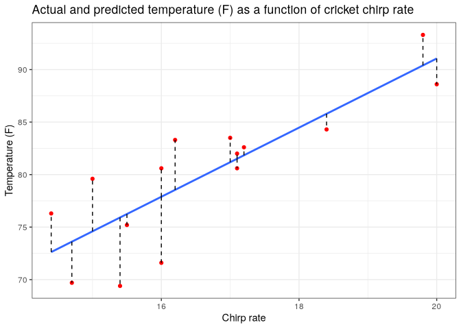
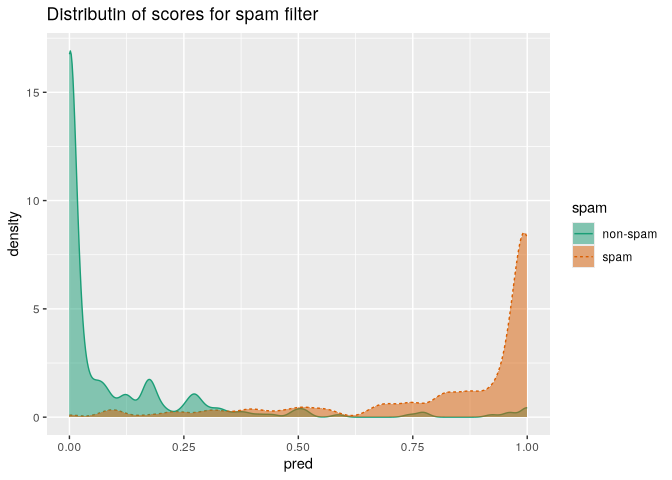
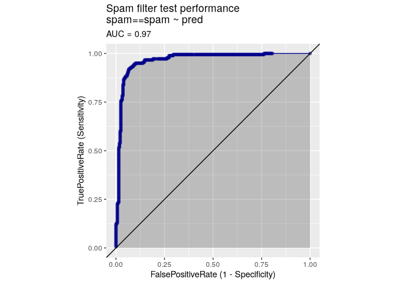
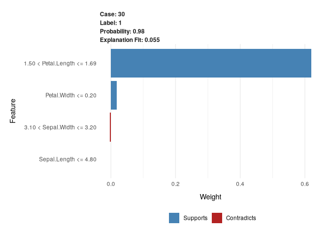
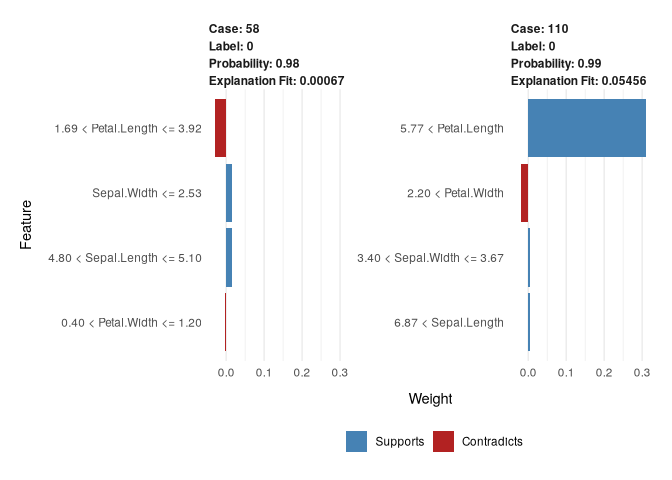
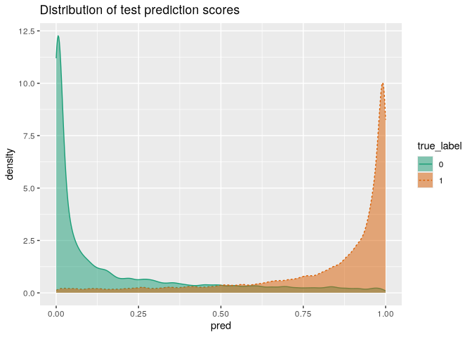
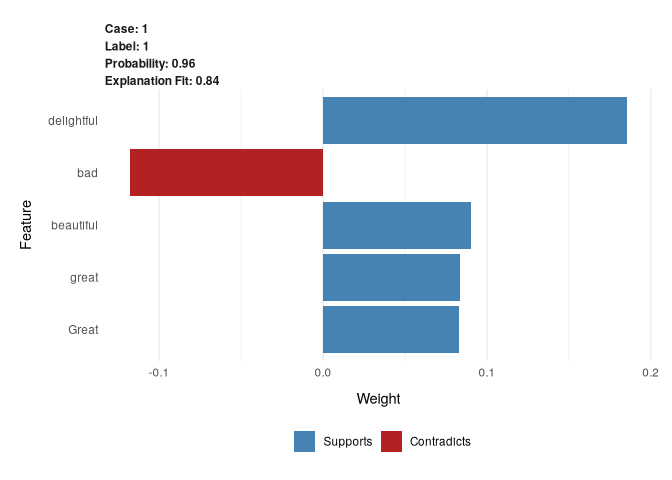
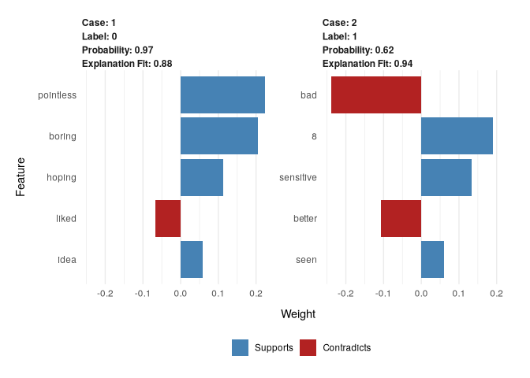

# Evaluating models


``` r
library(data.table)
```

# Evaluating classification models

``` r
spam_d <- fread("repo-clone/Spambase/spamD.tsv", 
                header = T, sep = "\t")
spam_train <- spam_d[rgroup >= 10, ]
spam_test <- spam_d[rgroup < 10, ]
spam_vars <- setdiff(colnames(spam_d), list("rgroup", "spam"))

spam_formula <- as.formula(
  paste('spam == "spam"', paste(spam_vars, collapse = ' + '),
        sep = ' ~ '))
spam_model <- glm(spam_formula, family = binomial(link = 'logit'),
                  data = spam_train)
```

    Warning: glm.fit: fitted probabilities numerically 0 or 1 occurred

``` r
spam_train$pred <- predict(spam_model, newdata = spam_train,
                           type = 'response')
spam_test$pred <- predict(spam_model, newdata = spam_test,
                          type = "response")
```

``` r
sample <- spam_test[c(7, 35, 224, 327), c("spam", "pred")]
sample
```

           spam         pred
         <char>        <num>
    1:     spam 0.9903246227
    2:     spam 0.4800498077
    3: non-spam 0.0006846551
    4: non-spam 0.0001434345

## Confusion matrix

``` r
confmat_spam <- table(
  truth = spam_test$spam,
  prediction = ifelse(spam_test$pred > 0.5, "spam", "non-spam")
)
confmat_spam
```

              prediction
    truth      non-spam spam
      non-spam      264   14
      spam           22  158

## Precision, recall, F1, specificity

``` r
(precision <- confmat_spam[2,2] / (confmat_spam[2,2] + confmat_spam[1,2]))
```

    [1] 0.9186047

``` r
(recall <- confmat_spam[2,2] / (confmat_spam[2,2] + confmat_spam[2,1]))
```

    [1] 0.8777778

``` r
(F1 <- 2 * precision * recall / (precision + recall))
```

    [1] 0.8977273

``` r
(specificity <- confmat_spam[1,1] / (confmat_spam[1,1] + confmat_spam[1,2]))
```

    [1] 0.9496403

How the volume of spam affects filter performance

``` r
set.seed(234641)
N <- nrow(spam_test)
pull_out_idx <- sample.int(N, 100, replace = F)
removed <- spam_test[pull_out_idx]

get_performance <- function(test) {
  proportion <- mean(test$spam == "spam")
  confmat_spam <- table(truth = test$spam,
                        prediction = ifelse(test$pred > 0.5,
                                            "spam", "non-spam"))
  precision <- confmat_spam[2,2] / (confmat_spam[2,2] + confmat_spam[1,2])
  recall <- confmat_spam[2,2] / (confmat_spam[2,2] + confmat_spam[2,1])
  list(spam_proportion = proportion,
       confmat_spam = confmat_spam,
       precision = precision, recall = recall)
}
s_test <- spam_test[-pull_out_idx, ]
get_performance(s_test)
```

    $spam_proportion
    [1] 0.4078212

    $confmat_spam
              prediction
    truth      non-spam spam
      non-spam      201   11
      spam           17  129

    $precision
    [1] 0.9214286

    $recall
    [1] 0.8835616

Add extra spam

``` r
get_performance(rbind(s_test, subset(removed, spam == "spam")))
```

    $spam_proportion
    [1] 0.4591837

    $confmat_spam
              prediction
    truth      non-spam spam
      non-spam      201   11
      spam           22  158

    $precision
    [1] 0.9349112

    $recall
    [1] 0.8777778

Add extra non-spam

``` r
get_performance(rbind(s_test, subset(removed, spam == "non-spam")))
```

    $spam_proportion
    [1] 0.3443396

    $confmat_spam
              prediction
    truth      non-spam spam
      non-spam      264   14
      spam           17  129

    $precision
    [1] 0.9020979

    $recall
    [1] 0.8835616

## Evaluating scoring models

Predict temperature from cricket chirp rate

``` r
crickets <- fread("repo-clone/cricketchirps/crickets.csv")
head(crickets)
```

       chirp_rate temperatureF
            <num>        <num>
    1:       20.0         88.6
    2:       16.0         71.6
    3:       19.8         93.3
    4:       18.4         84.3
    5:       17.1         80.6
    6:       15.5         75.2

``` r
cricket_model <- lm(temperatureF ~ chirp_rate, data = crickets)
crickets$temp_pred <- predict(cricket_model, newdata = crickets)
```

``` r
library(ggplot2)
ggplot(crickets, aes(x = chirp_rate, y = temperatureF)) +
  geom_point(color = "red") +
  geom_smooth(method = "lm", se = F) +
  geom_segment(aes(x = chirp_rate, xend = chirp_rate, 
                   y = temp_pred, yend = temperatureF),
    color = "black", linetype = "dashed"
  ) +
  theme_bw() +
  xlab("Chirp rate") +
  ylab("Temperature (F)") +
  ggtitle("Actual and predicted temperature (F) as a function of cricket chirp rate")
```

    `geom_smooth()` using formula = 'y ~ x'



``` r
cricket_model
```


    Call:
    lm(formula = temperatureF ~ chirp_rate, data = crickets)

    Coefficients:
    (Intercept)   chirp_rate  
         25.232        3.291  

``` r
summary(cricket_model)
```


    Call:
    lm(formula = temperatureF ~ chirp_rate, data = crickets)

    Residuals:
       Min     1Q Median     3Q    Max 
    -6.515 -1.971  0.490  2.807  5.001 

    Coefficients:
                Estimate Std. Error t value Pr(>|t|)    
    (Intercept)  25.2323    10.0601   2.508 0.026183 *  
    chirp_rate    3.2911     0.6012   5.475 0.000107 ***
    ---
    Signif. codes:  0 '***' 0.001 '**' 0.01 '*' 0.05 '.' 0.1 ' ' 1

    Residual standard error: 3.829 on 13 degrees of freedom
    Multiple R-squared:  0.6975,    Adjusted R-squared:  0.6742 
    F-statistic: 29.97 on 1 and 13 DF,  p-value: 0.0001067

RMSE

``` r
sqrt(mean((crickets$temp_pred - crickets$temperatureF)^2))
```

    [1] 3.564149

R-squared

``` r
error_sq <- (crickets$temp_pred - crickets$temperatureF)^2
numerator <- sum(error_sq)
delta_sq <- (mean(crickets$temperatureF) - crickets$temperatureF)^2
denominator <- sum(delta_sq)

(R2 <- 1 - numerator / denominator)
```

    [1] 0.6974651

## Evaluating probability models

### Double density plot

``` r
library(WVPlots)
DoubleDensityPlot(spam_test,
                  xvar = "pred", truthVar = "spam",
                  title = "Distributin of scores for spam filter")
```



### ROC and AUC

``` r
ROCPlot(spam_test,
        xvar = "pred",
        truthVar = "spam", truthTarget = "spam",
        title = "Spam filter test performance")
```



``` r
sigr::calcAUC(spam_test$pred, spam_test$spam == "spam")
```

    [1] 0.9660072

### Log likelihood

``` r
ylogpy <- function(y, py) {
  logpy <- ifelse(py > 0, log(py), 0)
  y * logpy
}

y <- spam_test$spam == "spam"
sum(ylogpy(y, spam_test$pred) +
      ylogpy(1 - y, 1 - spam_test$pred))
```

    [1] -134.9478

> null model’s likelihood

``` r
(p_null <- mean(spam_train$spam == "spam"))
```

    [1] 0.3941588

``` r
sum(ylogpy(y, p_null) + ylogpy(1 - y, 1 - p_null))
```

    [1] -306.8964

Log likelihood of the model is better.

## Deviance

`-2*(logLikelihood - S)` where is is the log likelihood of the saturated
model. In most cases, the model is perfect so `S=0`.

The ratio between the null deviance and the model deviance is used to
calculate a *pseudo R-squared*.

``` r
library(sigr)
(deviance <- calcDeviance(spam_test$pred,
                          spam_test$spam == "spam"))
```

    [1] 253.8598

``` r
(null_deviance <- calcDeviance(p_null, spam_test$spam == "spam"))
```

    [1] 613.7929

``` r
(pseudo_R2 <- 1 - deviance / null_deviance)
```

    [1] 0.586408

# Local interpretable model-agnostic explanations (LIME)

LIME produces an “explanation” of a model’s prediction on a specific
datum. That is, LIME tries to determine which features of that datum
contributed the most to the model’s decision about it.

## Example

Suppose you have a dataset of petal and sepal measurements for three
varieties of iris. The object is to predict whether a given iris is a
setosa based on its petal and sepal dimensions.

``` r
iris <- iris
iris$class <- as.numeric(iris$Species == "setosa")
```

``` r
set.seed(2345)
in_train <- runif(nrow(iris)) < 0.75
train <- iris[in_train, ]
test <- iris[!in_train, ]
head(train)
```

      Sepal.Length Sepal.Width Petal.Length Petal.Width Species class
    1          5.1         3.5          1.4         0.2  setosa     1
    2          4.9         3.0          1.4         0.2  setosa     1
    3          4.7         3.2          1.3         0.2  setosa     1
    4          4.6         3.1          1.5         0.2  setosa     1
    5          5.0         3.6          1.4         0.2  setosa     1
    6          5.4         3.9          1.7         0.4  setosa     1

``` r
source("repo-clone/LIME_iris/lime_iris_example.R")

input <- as.matrix(train[, 1:4])
model <- fit_iris_example(input, train$class)
```

    [1] train-logloss:0.454781+0.000056 test-logloss:0.454951+0.001252 
    [11]    train-logloss:0.032154+0.000045 test-logloss:0.032292+0.001015 
    [21]    train-logloss:0.020894+0.000931 test-logloss:0.021263+0.001448 
    [31]    train-logloss:0.020881+0.000933 test-logloss:0.021271+0.001580 
    [41]    train-logloss:0.020881+0.000933 test-logloss:0.021274+0.001597 
    [51]    train-logloss:0.020881+0.000933 test-logloss:0.021274+0.001599 
    [61]    train-logloss:0.020881+0.000933 test-logloss:0.021274+0.001599 
    [71]    train-logloss:0.020881+0.000933 test-logloss:0.021274+0.001599 
    [81]    train-logloss:0.020881+0.000933 test-logloss:0.021274+0.001599 
    [91]    train-logloss:0.020881+0.000933 test-logloss:0.021274+0.001599 
    [100]   train-logloss:0.020881+0.000933 test-logloss:0.021274+0.001599 

``` r
predictions <- predict(model, newdata = as.matrix(test[, 1:4]))
te_frame <- data.frame(is_setosa = ifelse(test$class == 1,
                                         "setosa", "not setosa"),
                       pred = ifelse(predictions > 0.5,
                                     "setosa", "not setosa"))
with(te_frame, table(truth = is_setosa, pred = pred))
```

                pred
    truth        not setosa setosa
      not setosa         25      0
      setosa              0     11

The classification is perfect. Use the `lime` package to explain an
instance.

``` r
library(lime)
explainer <- lime(train[,1:4],
                  model = model,
                  bin_continuous = T,
                  n_bins = 10)
```

``` r
(example <- test[5, 1:4, drop = F])
```

       Sepal.Length Sepal.Width Petal.Length Petal.Width
    30          4.7         3.2          1.6         0.2

``` r
test$class[5]
```

    [1] 1

``` r
round(predict(model, newdata = as.matrix(example)))
```

    [1] 1

``` r
explanation <- lime::explain(example,
                             explainer,
                             n_label = 1,
                             n_features = 4)
plot_features(explanation)
```



``` r
(example <- test[c(13, 24), 1:4])
```

        Sepal.Length Sepal.Width Petal.Length Petal.Width
    58           4.9         2.4          3.3         1.0
    110          7.2         3.6          6.1         2.5

``` r
test$class[c(13, 24)]
```

    [1] 0 0

``` r
round(predict(model, newdata = as.matrix(example)))
```

    [1] 0 0

``` r
explanation <- explain(
  example, explainer, n_labels = 1, n_features = 4, kernel_width = 0.5
)
plot_features(explanation)
```



## Text classification

For this example, you will classify movie reviews from the Internet
Movie Database (IMDB). The task is to identify positive reviews.

Each RDS object is a list with two elements: a character vector
representing 25,000 reviews, and a vector of numeric labels where 1
means a positive review and 0 a negative review. 13 You will again fit
an xgboost model to classify the reviews.

You might wonder how LIME jitters a text datum. It does so by randomly
removing words from the document, and then converting the resulting new
text into the appropriate representation for the model. If removing a
word tends to change the classification of a document, then that word is
probably important to the model.

``` r
library(zeallot)
c(texts, labels) %<-% readRDS("repo-clone/IMDB/IMDBtrain.RDS")
```

A positive review

``` r
list(text = texts[1], label = labels[1])
```

    $text
                                                                                                                                                                                                                                                                                                                                                                                                                                                                                                                                                                                                                                                                                                                                                                                                                                                                                                                                                             train_21317 
    "Forget depth of meaning, leave your logic at the door, and have a great time with this maniacally funny, totally absurdist, ultra-campy live-action \"cartoon\". MYSTERY MEN is a send-up of every superhero flick you've ever seen, but its unlikely super-wannabes are so interesting, varied, and well-cast that they are memorable characters in their own right. Dark humor, downright silliness, bona fide action, and even a touching moment or two, combine to make this comic fantasy about lovable losers a true winner. The comedic talents of the actors playing the Mystery Men -- including one Mystery Woman -- are a perfect foil for Wes Studi as what can only be described as a bargain-basement Yoda, and Geoffrey Rush as one of the most off-the-wall (and bizarrely charming) villains ever to walk off the pages of a Dark Horse comic book and onto the big screen. Get ready to laugh, cheer, and say \"huh?\" more than once.... enjoy!" 

    $label
    train_21317 
              1 

A negative review

``` r
list(text = texts[12], label = labels[12])
```

    $text
                                                                                                                                                                                                                                                                                                                                                                                                                                                                                                                                                                  train_385 
    "Jameson Parker And Marilyn Hassett are the screen's most unbelievable couple since John Travolta and Lily Tomlin. Larry Peerce's direction wavers uncontrollably between black farce and Roman tragedy. Robert Klein certainly think it's the former and his self-centered performance in a minor role underscores the total lack of balance and chemistry between the players in the film. Normally, I don't like to let myself get so ascerbic, but The Bell Jar is one of my all-time favorite books, and to watch what they did with it makes me literally crazy." 

    $label
    train_385 
            0 

## Representing documents for modeling

Avoid words that are too common or too rare. Too common will be words
that show up in over half the documents, too rare will be words that
show up in fewer than 0.1% of the documents. Build a vocabulary of
10,000 words.

## Training the text classifier

``` r
source("repo-clone/IMDB/lime_imdb_example.R")

vocab <- create_pruned_vocabulary(texts)
dtm_train <- make_matrix(texts, vocab)
model <- fit_imdb_model(dtm_train, labels)
```

Load test data and evaluate the model

``` r
c(test_txt, test_labels) %<-% readRDS("repo-clone/IMDB/IMDBtest.RDS")
dtm_test <- make_matrix(test_txt, vocab)
predicted <- predict(model, newdata = dtm_test)
te_frame <- data.frame(
  true_label = test_labels,
  pred = predicted)
(cmat <- with(te_frame, table(truth = true_label,
                              pred = pred > 0.5)))
```

         pred
    truth FALSE  TRUE
        0 10841  1659
        1  1470 11030

``` r
DoubleDensityPlot(te_frame, "pred", "true_label",
                  "Distribution of test prediction scores")
```



## Explaining predictions

``` r
casename <- "test_19552"
explain_case <- function(casename, model, vocabin) {
  sample_case <- test_txt[casename]
  pred_prob <- predict(model, make_matrix(sample_case, vocabin))
  list(text = sample_case,
       label = test_labels[casename],
       prediction = round(pred_prob))
}
explain_case(casename, model, vocab)
```

    $text
                                                                                                                                         test_19552 
    "Great story, great music. A heartwarming love story that's beautiful to watch and delightful to listen to. Too bad there is no soundtrack CD." 

    $label
    test_19552 
             1 

    $prediction
    [1] 1

``` r
explainer <- lime(texts, model = model,
                  preprocess = function(x) make_matrix(x, vocab))
explainer_case <- function(casename, explainer, n_labels = 1, n_features = 5) {
  sample_case <- test_txt[casename]
  lime::explain(sample_case,
                 explainer,
                 n_labels = 1,
                 n_features = 5)
}
explanation <- explainer_case(casename, explainer)
plot_features(explanation)
```



This only works from the console.

``` r
plot_text_explanations(explanation)
```

``` r
casenames <- c("test_12034", "test_10294")
explain_case(casenames, model, vocab)
```

    $text
                                                                                                                                                                                                            test_12034 
                                              "I don't know why I even watched this film. I think it was because I liked the idea of the scenery and was hoping the film would be as good. Very boring and pointless." 
                                                                                                                                                                                                            test_10294 
    "To anyone who likes the TV series: forget the movie. The jokes are bad and some topics are much too sensitive to laugh about it.<br /><br />We have seen much better acting by R. Dueringer in \"Hinterholz 8\"." 

    $label
    test_12034 test_10294 
             0          0 

    $prediction
    [1] 0 1

``` r
explanation <- explainer_case(casenames, explainer)
plot_features(explanation)
```



Note the uncertainty for case 2 and the strange choice of key words.

``` r
predict(model, newdata = make_matrix(test_txt[casenames][2],
                                     vocab))
```

    [1] 0.6236976

``` r
test_txt[casenames][2]
```

                                                                                                                                                                                                            test_10294 
    "To anyone who likes the TV series: forget the movie. The jokes are bad and some topics are much too sensitive to laugh about it.<br /><br />We have seen much better acting by R. Dueringer in \"Hinterholz 8\"." 

The discrepancy between the model’s prediction and the explainer’s
estimate is due to the explainer using a linear approximation of the
model rather than the model itself.

The number 8 is likely due to numerical reviews. We can remove numbers
from the vocabulary.

``` r
vocab[is.numeric(vocab$term)]
```

    Number of docs:  
    0 stopwords:  ... 
     
    Vocabulary: 
    Null data.table (0 rows and 0 cols)

``` r
str(vocab)
```

    Classes 'text2vec_vocabulary' and 'data.frame': 10000 obs. of  3 variables:
     $ term      : chr  "his" "he" "by" "they" ...
     $ term_count: int  29352 26895 22538 21097 20604 20573 20489 20269 18399 17997 ...
     $ doc_count : int  10676 9884 11717 10351 11138 11695 11712 11671 6456 10337 ...
     - attr(*, "ngram")= Named int [1:2] 1 1
      ..- attr(*, "names")= chr [1:2] "ngram_min" "ngram_max"
     - attr(*, "document_count")= int 25000
     - attr(*, "stopwords")= chr [1:8] "the" "a" "an" "this" ...
     - attr(*, "sep_ngram")= chr "_"

``` r
numbers_only <- function(x) !grepl("\\D", x)
vocab_nonums <- vocab[!numbers_only(vocab$term),]
length(vocab_nonums$term)
```

    [1] 9863

``` r
dtm_train_nonums <- make_matrix(texts, vocab_nonums)
model_nonums <- fit_imdb_model(dtm_train_nonums, labels)
```

``` r
casenames <- c("test_12034", "test_10294")
explain_case(casenames, model_nonums, vocab_nonums)
```

    $text
                                                                                                                                                                                                            test_12034 
                                              "I don't know why I even watched this film. I think it was because I liked the idea of the scenery and was hoping the film would be as good. Very boring and pointless." 
                                                                                                                                                                                                            test_10294 
    "To anyone who likes the TV series: forget the movie. The jokes are bad and some topics are much too sensitive to laugh about it.<br /><br />We have seen much better acting by R. Dueringer in \"Hinterholz 8\"." 

    $label
    test_12034 test_10294 
             0          0 

    $prediction
    [1] 0 0

``` r
explainer_nonums <- lime(texts, model = model_nonums,
                         preprocess = function(x) make_matrix(x, vocab_nonums))
```

``` r
explanation_nonums <- explainer_case(casenames, explainer_nonums)
plot_features(explanation_nonums)
```


