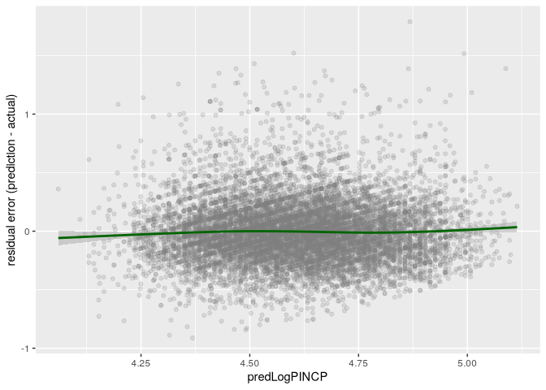

# Linear Regression


``` r
library(data.table)
```

# Using Linear Regression

## Intro PUMS dataset

For this task, you will use the 2016 US Census PUMS dataset. For
simplicity, we have prepared a small sample of PUMS data to use for this
example. The data preparation steps include these: - Restricting the
data to full-time employees between 20 and 50 years of age, with an
income between \$1,000 and \$250,000. - Dividing the data into a
training set, dtrain, and a test set, dtest.

``` r
psub <- readRDS("repo-clone/PUMS/psub.RDS")
names(psub)
```

      [1] "RT"        "SERIALNO"  "SPORDER"   "PUMA"      "ST"        "ADJINC"   
      [7] "AGEP"      "CIT"       "CITWP"     "COW"       "DDRS"      "DEAR"     
     [13] "DEYE"      "DOUT"      "DPHY"      "DRAT"      "DRATX"     "DREM"     
     [19] "ENG"       "FER"       "GCL"       "GCM"       "GCR"       "HINS1"    
     [25] "HINS2"     "HINS3"     "HINS4"     "HINS5"     "HINS6"     "HINS7"    
     [31] "INTP"      "JWMNP"     "JWRIP"     "JWTR"      "LANP"      "LANX"     
     [37] "MAR"       "MARHD"     "MARHM"     "MARHT"     "MARHW"     "MARHYP"   
     [43] "MIG"       "MIL"       "MLPA"      "MLPB"      "MLPCD"     "MLPE"     
     [49] "MLPFG"     "MLPH"      "MLPI"      "MLPJ"      "MLPK"      "NWAB"     
     [55] "NWAV"      "NWLA"      "NWLK"      "NWRE"      "OIP"       "PAP"      
     [61] "RELP"      "RETP"      "SCH"       "SCHG"      "SCHL"      "SEMP"     
     [67] "SEX"       "SSIP"      "SSP"       "WAGP"      "WKHP"      "WKL"      
     [73] "WKW"       "WRK"       "YOEP"      "ANC"       "ANC1P"     "ANC2P"    
     [79] "DECADE"    "DIS"       "DRIVESP"   "ESP"       "ESR"       "FHICOVP"  
     [85] "FOD1P"     "FOD2P"     "HICOV"     "HISP"      "INDP"      "JWAP"     
     [91] "JWDP"      "MIGPUMA"   "MIGSP"     "MSP"       "NAICSP"    "NATIVITY" 
     [97] "NOP"       "OC"        "OCCP"      "PAOC"      "PERNP"     "PINCP"    
    [103] "POBP"      "POVPIP"    "POWPUMA"   "POWSP"     "PRIVCOV"   "PUBCOV"   
    [109] "QTRBIR"    "RAC1P"     "RAC2P"     "RAC3P"     "RACAIAN"   "RACASN"   
    [115] "RACBLK"    "RACNH"     "RACNUM"    "RACPI"     "RACSOR"    "RACWHT"   
    [121] "RC"        "SCIENGP"   "SCIENGRLP" "SFN"       "SFR"       "SOCP"     
    [127] "VPS"       "WAOB"      "FAGEP"     "FANCP"     "FCITP"     "FCITWP"   
    [133] "FCOWP"     "FDDRSP"    "FDEARP"    "FDEYEP"    "FDISP"     "FDOUTP"   
    [139] "FDPHYP"    "FDRATP"    "FDRATXP"   "FDREMP"    "FENGP"     "FESRP"    
    [145] "FFERP"     "FFODP"     "FGCLP"     "FGCMP"     "FGCRP"     "FHINS1P"  
    [151] "FHINS2P"   "FHINS3C"   "FHINS3P"   "FHINS4C"   "FHINS4P"   "FHINS5C"  
    [157] "FHINS5P"   "FHINS6P"   "FHINS7P"   "FHISP"     "FINDP"     "FINTP"    
    [163] "FJWDP"     "FJWMNP"    "FJWRIP"    "FJWTRP"    "FLANP"     "FLANXP"   
    [169] "FMARHDP"   "FMARHMP"   "FMARHTP"   "FMARHWP"   "FMARHYP"   "FMARP"    
    [175] "FMIGP"     "FMIGSP"    "FMILPP"    "FMILSP"    "FOCCP"     "FOIP"     
    [181] "FPAP"      "FPERNP"    "FPINCP"    "FPOBP"     "FPOWSP"    "FPRIVCOVP"
    [187] "FPUBCOVP"  "FRACP"     "FRELP"     "FRETP"     "FSCHGP"    "FSCHLP"   
    [193] "FSCHP"     "FSEMP"     "FSEXP"     "FSSIP"     "FSSP"      "FWAGP"    
    [199] "FWKHP"     "FWKLP"     "FWKWP"     "FWRKP"     "FYOEP"     "stdworker"

``` r
set.seed(3454351)
psub$gp <- runif(nrow(psub))
dtrain <- subset(psub, gp >= 0.5)
dtest <- subset(psub, gp < 0.5)
nrow(psub); nrow(dtrain); nrow(dtest)
```

    [1] 22241

    [1] 11203

    [1] 11038

``` r
model <- lm(log10(PINCP) ~ AGEP + SEX + COW + SCHL, data = dtrain)
dtest$predLogPINCP <- predict(model, newdata = dtest)
dtrain$preLogPINCP <- predict(model, newdata = dtrain)
```

Fitting logarithm-transformed data typically gives results with smaller
relative error, emphasizing smaller errors on smaller incomes. But this
improved relative error comes at a cost of introducing a bias: on
average, predicted incomes are going to be below actual training
incomes. An unbiased alternative to predicting log(income) would be to
use a type of generalized linear model called Poisson regression. We
will discuss generalized linear models (specifically, logistic
regression) in section 7.2. The Poisson regression is unbiased, but
typically at the cost of larger relative errors.

## Prediction quality

``` r
library(ggplot2)
ggplot(dtest, aes(x = predLogPINCP, y = log10(PINCP))) +
  geom_point(alpha = 0.2, color = "grey80") +
  geom_smooth(color = "darkblue") +
  geom_line(aes(x = log10(PINCP), y = log10(PINCP)),
                color = "black", linetype = 2) +
  coord_cartesian(xlim = c(4, 5.25),
                  ylim = c(3.5, 5.5))
```

    `geom_smooth()` using method = 'gam' and formula = 'y ~ s(x, bs = "cs")'


Residual plot

``` r
ggplot(dtest, aes(x = predLogPINCP, y = predLogPINCP - log10(PINCP))) +
  geom_point(alpha = 0.2, color = "grey50") +
  geom_smooth(color = "darkgreen") +
  ylab("residual error (prediction - actual)")
```

    `geom_smooth()` using method = 'gam' and formula = 'y ~ s(x, bs = "cs")'



Considerations of residual plots

1.  Are predictions correct on average?

Does the smoothing curve lie more or less along the line of perfect
prediction? Ideally, the points will all lie very close to that line,
but you may instead get a wider cloud of points (as we do in figures 7.6
and 7.7) if your input variables don’t explain the output too closely.
But if the smoothing curve lies along the line of perfect prediction and
“down the middle” of the cloud of points, then the model predicts
correctly on average: it underpredicts about as much as it overpredicts.

2.  Are there systematic errors?

If the smoothing curve veers off the line of perfect prediction too
much, as in figure 7.8, this is a sign of systematic under or
overprediction in certain ranges: the error is correlated with the
prediction. Systematic errors indicate that the system is not “linear
enough” for a linear model to be a good fit, so you should try one of
the different modeling approaches that we will discuss later in this
book.

3.  R-squared and RMSE

``` r
rsq <- function(y, f) {1 - sum((y - f)^2)/sum((y - mean(y))^2)}

rsq(log10(dtrain$PINCP), dtrain$preLogPINCP)
```

    [1] 0.2976165

``` r
rsq(log10(dtest$PINCP), dtest$predLogPINCP)
```

    [1] 0.2911965

For well-fit models, R-squared is also equal to the square of the
correlation between the predicted values and actual training values.

``` r
cor(log10(dtrain$PINCP), dtrain$preLogPINCP)^2
```

    [1] 0.2976165

``` r
mod_sum <- summary(model)
mod_sum$r.squared; mod_sum$adj.r.squared
```

    [1] 0.2976165

    [1] 0.2966118

``` r
rmse <- function(y, f) { sqrt(mean((y - f)^2)) }
rmse(log10(dtrain$PINCP), dtrain$preLogPINCP)
```

    [1] 0.2685855

``` r
rmse(log10(dtest$PINCP), dtest$predLogPINCP)
```

    [1] 0.2675129

## Finding relations and extracting advice

``` r
coefficients(model)
```

                           (Intercept)                               AGEP 
                            4.00588563                         0.01159846 
                             SEXFemale     COWFederal government employee 
                           -0.10768834                         0.06386719 
          COWLocal government employee COWPrivate not-for-profit employee 
                           -0.02970932                        -0.03301963 
         COWSelf employed incorporated  COWSelf employed not incorporated 
                            0.01454745                        -0.12822845 
          COWState government employee    SCHLRegular high school diploma 
                           -0.04795709                         0.11353857 
     SCHLGED or alternative credential SCHLsome college credit, no degree 
                            0.12166699                         0.18382783 
                SCHLAssociate's degree              SCHLBachelor's degree 
                            0.23870449                         0.36371138 
                   SCHLMaster's degree            SCHLProfessional degree 
                            0.44457769                         0.51111666 
                  SCHLDoctorate degree 
                            0.48187005 

Someone with a bachelor’s degree earns on average 2.3 times more than
someone without a HS diploma and 1.8 times more than someone with a HS
diploma.

``` r
10^.3637
```

    [1] 2.310468

``` r
10^(.3637 - .1135)
```

    [1] 1.779099

The intercept

In our example, the reference subject would be a male employee of a
private for-profit company, with no high school degree, who is zero
years old. If such a person could exist, the model would predict their
log base 10 income to be about 4.0, which corresponds to an income of
\$10,000.

## Reliability/quality of coefficients

> formula

``` r
summary(model)$call
```

    lm(formula = log10(PINCP) ~ AGEP + SEX + COW + SCHL, data = dtrain)

> residuals

``` r
summary(summary(model)$residuals)
```

       Min. 1st Qu.  Median    Mean 3rd Qu.    Max. 
    -1.5038 -0.1354  0.0187  0.0000  0.1710  0.9741 

``` r
(resids_train <- summary(log10(dtrain$PINCP) - 
                           predict(model, newdata = dtrain)))
```

       Min. 1st Qu.  Median    Mean 3rd Qu.    Max. 
    -1.5038 -0.1354  0.0187  0.0000  0.1710  0.9741 

``` r
(resids_test <- summary(log10(dtest$PINCP) - 
                           predict(model, newdata = dtest)))
```

         Min.   1st Qu.    Median      Mean   3rd Qu.      Max. 
    -1.789150 -0.130733  0.027413  0.006359  0.175847  0.912646 

Looking for a median near 0 and 1st and 3rd quantiles roughly
equidistant from the median.

> coefficients

``` r
options(digits = 6)
summary(model)$coefficients
```

                                         Estimate  Std. Error    t value
    (Intercept)                         4.0058856 0.014426452 277.676434
    AGEP                                0.0115985 0.000303153  38.259416
    SEXFemale                          -0.1076883 0.005256711 -20.485877
    COWFederal government employee      0.0638672 0.015752136   4.054510
    COWLocal government employee       -0.0297093 0.010737030  -2.766996
    COWPrivate not-for-profit employee -0.0330196 0.010244869  -3.223040
    COWSelf employed incorporated       0.0145475 0.016474236   0.883043
    COWSelf employed not incorporated  -0.1282285 0.013470832  -9.518971
    COWState government employee       -0.0479571 0.012327531  -3.890243
    SCHLRegular high school diploma     0.1135386 0.010723554  10.587774
    SCHLGED or alternative credential   0.1216670 0.017303815   7.031224
    SCHLsome college credit, no degree  0.1838278 0.010646094  17.267162
    SCHLAssociate's degree              0.2387045 0.012356835  19.317608
    SCHLBachelor's degree               0.3637114 0.010580987  34.374051
    SCHLMaster's degree                 0.4445777 0.012710038  34.978470
    SCHLProfessional degree             0.5111167 0.020179954  25.327940
    SCHLDoctorate degree                0.4818700 0.024516238  19.655138
                                           Pr(>|t|)
    (Intercept)                         0.00000e+00
    AGEP                               4.29744e-301
    SEXFemale                           1.36432e-91
    COWFederal government employee      5.05799e-05
    COWLocal government employee        5.66684e-03
    COWPrivate not-for-profit employee  1.27201e-03
    COWSelf employed incorporated       3.77232e-01
    COWSelf employed not incorporated   2.10767e-21
    COWState government employee        1.00724e-04
    SCHLRegular high school diploma     4.51079e-26
    SCHLGED or alternative credential   2.16663e-12
    SCHLsome college credit, no degree  5.93312e-66
    SCHLAssociate's degree              8.15524e-82
    SCHLBachelor's degree              3.00468e-246
    SCHLMaster's degree                1.78708e-254
    SCHLProfessional degree            1.13962e-137
    SCHLDoctorate degree                1.38525e-84

In terms of prediction (our primary goal), it’s not a problem to have a
small number of insignificant coefficients with small effects sizes.
Problems arise when we have insignificant coefficients with large
coefficients/effects or a great number of insignificant coefficients.

Signs of potential collinearity between variables - removal of an
insignificant variable increases the significance of another -
unreasonably large coefficients or ses - unexpected signs on
coefficients

> Degrees of freedom

Note that for test data, the df is equal to the number of rows.

``` r
summary(model)$df
```

    [1]    17 11186    17

``` r
(df <- nrow(dtrain) - nrow(summary(model)$coefficients))
```

    [1] 11186

> Residual standard error

``` r
sqrt(sum(residuals(model)^2) / df)
```

    [1] 0.26879

``` r
sqrt(sum(mod_sum$residuals^2) / mod_sum$df[[2]])
```

    [1] 0.26879
