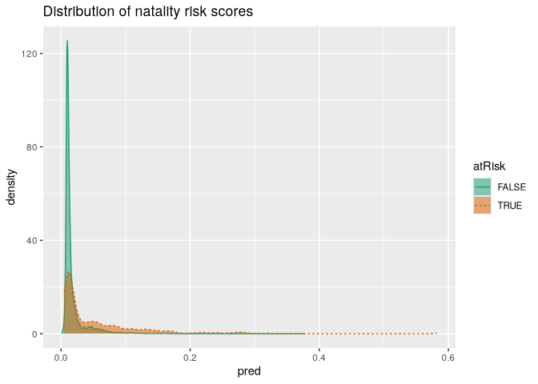
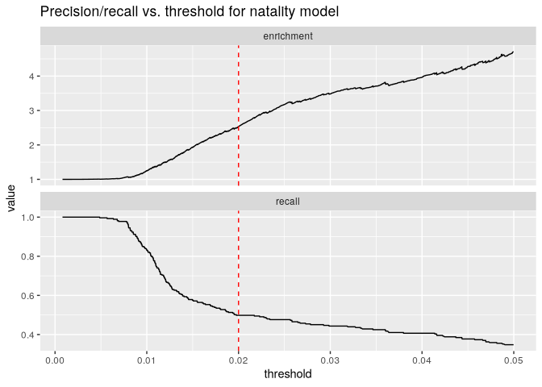

# Logistic Regression


``` r
library(data.table)
```

Predict values between 0 and 1, eg. probabilities, used for
classification.

Logit and sigmoid functions are inverses.

``` r
logit <- function(p) { log(p / (1 - p))}
sigmoid <- function(x) { 1 / (1 + exp(-x))}
sigmoid(logit(0.7))
```

    [1] 0.7

The overall goal is to design a plan that provisions neonatal emergency
equipment to delivery rooms. Newborn babies are assessed at one and five
minutes after birth using what’s called the Apgar test, which is
designed to determine if a baby needs immediate emergency care or extra
medical attention. A baby who scores below 7 (on a scale from 0 to 10)
on the Apgar scale needs extra attention.

We’ll use a sample dataset from the 2010 CDC natality public-use data
file (http://mng.bz/pnGy). This dataset records statistics for all US
births registered in the 50 states and the District of Columbia,
including facts about the mother and father, and about the delivery. The
sample has just over 26,000 births in a data frame called sdata.1 The
data is split into training and test sets, using a random grouping
column that we added, which allows for repeatable experiments with the
split ratio.

``` r
load("repo-clone/CDC/NatalRiskData.rData")
train <- sdata[sdata$ORIGRANDGROUP <= 5, ]
test <- sdata[sdata$ORIGRANDGROUP > 5, ]
```

``` r
names(train)
```

     [1] "PWGT"          "UPREVIS"       "CIG_REC"       "GESTREC3"     
     [5] "DPLURAL"       "ULD_MECO"      "ULD_PRECIP"    "ULD_BREECH"   
     [9] "URF_DIAB"      "URF_CHYPER"    "URF_PHYPER"    "URF_ECLAM"    
    [13] "atRisk"        "DBWT"          "ORIGRANDGROUP"

| Variable | Type | Description |
|----|----|----|
| atRisk | Logical | TRUE if 5-minute Apgar score \< 7; FALSE otherwise |
| PWGT | Numeric | Mother’s prepregnancy weight |
| UPREVIS | Numeric (integer) | Number of prenatal medical visits |
| CIG_REC | Logical | TRUE if smoker; FALSE otherwise |
| GESTREC3 | Categorical | Two categories: \<37 weeks (premature) and \>=37 weeks |
| DPLURAL | Categorical | Birth plurality, three categories: single/twin/triplet+ |
| ULD_MECO | Logical | TRUE if moderate/heavy fecal staining of amniotic fluid |
| ULD_PRECIP | Logical | TRUE for unusually short labor (\< three hours) |
| ULD_BREECH | Logical | TRUE for breech (pelvis first) birth position |
| URF_DIAB | Logical | TRUE if mother is diabetic |
| URF_CHYPER | Logical | TRUE if mother has chronic hypertension |
| URF_PHYPER | Logical | TRUE if mother has pregnancy-related hypertension |
| URF_ECLAM | Logical | TRUE if mother experienced eclampsia: pregnancy- related seizures |

## Building the logistic regression model

``` r
complications <- c("ULD_MECO", "ULD_PRECIP", "ULD_BREECH")
risk_factors <- c("URF_DIAB", "URF_CHYPER", "URF_PHYPER", "URF_ECLAM")

y <- "atRisk"
x <- c("PWGT", "UPREVIS", "CIG_REC", "GESTREC3", "DPLURAL",
       complications, risk_factors)
fmla <- wrapr::mk_formula(y, x)
fmla
```

    atRisk ~ PWGT + UPREVIS + CIG_REC + GESTREC3 + DPLURAL + ULD_MECO + 
        ULD_PRECIP + ULD_BREECH + URF_DIAB + URF_CHYPER + URF_PHYPER + 
        URF_ECLAM
    <environment: base>

``` r
model <- glm(fmla, data = train, family = binomial(link = "logit"))
```

The family argument can be used to select many different behaviors of
the glm() function. For example, choosing family = quasipoisson chooses
a “log” link, which models the logarithm of the prediction as linear in
the inputs. This would be another approach to try for the income
prediction problem of section 7.1. However, it is a subtle point to
determine whether a log transformation and linear model or a log-link
and a generalized linear model is a better choice for a given problem.
The log-link will be better at predicting total incomes (scoring an
error of \$50,000 for small and large incomes alike). The log-transform
method will be better at predicting relative incomes (a scoring error of
\$50,000 being less dire for large incomes than for small incomes).

## Predictions

``` r
train$pred <- predict(model, newdata = train, type = "response")
test$pred <- predict(model, newdata = test, type = "response")
```

``` r
sum(train$atRisk == TRUE)
```

    [1] 273

``` r
sum(train$pred)
```

    [1] 273

``` r
premature <- train[train$GESTREC3 == "< 37 weeks", ]
sum(premature$atRisk == TRUE)
```

    [1] 112

``` r
sum(premature$pred)
```

    [1] 112

### Prediction quality

``` r
WVPlots::DoubleDensityPlot(train, "pred", "atRisk",
                           title = "Distribution of natality risk scores")
```



Two sub-distributions are identified, but they are not easily seperable
by a threshold value.

### Enrichment and recall

``` r
library(ggplot2)
plt <- WVPlots::PRTPlot(train, "pred", "atRisk", TRUE,
                        plotvars = c("enrichment", "recall"),
                        thresholdrange = c(0, 0.05),
                        title = "Precision/recall vs. threshold for natality model")
plt + geom_vline(xintercept = 0.02, color = "red", linetype = 2)
```



With a threshold of 0.02 will identify those with a risk 2.5 times
higher than the overall population and contains about half of the true
at-risk situations.

``` r
( ctab_test <- table(pred = test$pred > 0.02, atRisk = test$atRisk) )
```

           atRisk
    pred    FALSE TRUE
      FALSE  9487   93
      TRUE   2405  116

``` r
( precision <- ctab_test[2,2]/sum(ctab_test[2,]) )
```

    [1] 0.04601349

``` r
( recall <- ctab_test[2,2]/sum(ctab_test[, 2]) )
```

    [1] 0.5550239

``` r
( enrichment <- precision / mean(as.numeric(test$atRisk)) )
```

    [1] 2.664159

The resulting classifier is low-precision, but identifies a set of
potential at-risk cases that contains 55.5% of the true positive cases
in the test set, at a rate 2.66 times higher than the overall average. T

``` r
sum(ctab_test[, 2])
```

    [1] 209

## Finding relations and extracting advice

``` r
coefficients(model)
```

                 (Intercept)                     PWGT                  UPREVIS 
                 -4.41218940               0.00376166              -0.06328943 
                 CIG_RECTRUE       GESTREC3< 37 weeks DPLURALtriplet or higher 
                  0.31316930               1.54518311               1.39419294 
                 DPLURALtwin             ULD_MECOTRUE           ULD_PRECIPTRUE 
                  0.31231871               0.81842627               0.19172008 
              ULD_BREECHTRUE             URF_DIABTRUE           URF_CHYPERTRUE 
                  0.74923672              -0.34646672               0.56002503 
              URF_PHYPERTRUE            URF_ECLAMTRUE 
                  0.16159872               0.49806435 

### Interpreting coefficients

Suppose a full-term baby with certain characteristics has a 1%
probability of being at risk. Then the risk odds for that baby are
p/(1-p), or 0.01/0.99 = 0.0101. What are the risk odds (and the risk
probability) for a baby with the same characteristics, but born
prematurely?

The odds of being at risk are 4.68883 times higher for GESTREC3 \< 37
weeks.

``` r
( odds <- exp(1.545183) )
```

    [1] 4.68883

The risk odds for the premature baby with the same characteristics would
be:

``` r
( odds <- odds * 0.0101 )
```

    [1] 0.04735718

``` r
( probability <- odds / (1 + odds) )
```

    [1] 0.04521588

## Model summary

``` r
summary(model)
```


    Call:
    glm(formula = fmla, family = binomial(link = "logit"), data = train)

    Coefficients:
                              Estimate Std. Error z value Pr(>|z|)    
    (Intercept)              -4.412189   0.289352 -15.249  < 2e-16 ***
    PWGT                      0.003762   0.001487   2.530 0.011417 *  
    UPREVIS                  -0.063289   0.015252  -4.150 3.33e-05 ***
    CIG_RECTRUE               0.313169   0.187230   1.673 0.094398 .  
    GESTREC3< 37 weeks        1.545183   0.140795  10.975  < 2e-16 ***
    DPLURALtriplet or higher  1.394193   0.498866   2.795 0.005194 ** 
    DPLURALtwin               0.312319   0.241088   1.295 0.195163    
    ULD_MECOTRUE              0.818426   0.235798   3.471 0.000519 ***
    ULD_PRECIPTRUE            0.191720   0.357680   0.536 0.591951    
    ULD_BREECHTRUE            0.749237   0.178129   4.206 2.60e-05 ***
    URF_DIABTRUE             -0.346467   0.287514  -1.205 0.228187    
    URF_CHYPERTRUE            0.560025   0.389678   1.437 0.150676    
    URF_PHYPERTRUE            0.161599   0.250003   0.646 0.518029    
    URF_ECLAMTRUE             0.498064   0.776948   0.641 0.521489    
    ---
    Signif. codes:  0 '***' 0.001 '**' 0.01 '*' 0.05 '.' 0.1 ' ' 1

    (Dispersion parameter for binomial family taken to be 1)

        Null deviance: 2698.7  on 14211  degrees of freedom
    Residual deviance: 2463.0  on 14198  degrees of freedom
    AIC: 2491

    Number of Fisher Scoring iterations: 7

Deviance residuals are useful for grouped data, not for ungrouped data
like in this case.

``` r
summary(summary(model)$deviance.resid)
```

       Min. 1st Qu.  Median    Mean 3rd Qu.    Max. 
    -0.9732 -0.1818 -0.1511 -0.1244 -0.1358  3.2641 

Null deviance is similar to the variance of the data around the average
rate of positive examples. Residual deviance is similar to the variance
of data around the model. Residual deviance should be small compared to
null deviance.

### Computing deviance

``` r
# y is the outcome in numeric form, py is the predicted probability that y == 1
loglikelihood <- function(y, py) {
  sum(y * log(py) + (1 - y) * log(1 - py))
}
( pnull <- mean(as.numeric(train$atRisk)) )
```

    [1] 0.01920912

``` r
( null_dev <- -2 * loglikelihood(as.numeric(train$atRisk), pnull) )
```

    [1] 2698.716

``` r
model$null.deviance
```

    [1] 2698.716

``` r
pred <- predict(model, newdata = train, type = "response")
( resid_dev <- -2 * loglikelihood(as.numeric(train$atRisk), pred) )
```

    [1] 2462.992

``` r
model$deviance
```

    [1] 2462.992

For test data

``` r
test_y <- as.numeric(test$atRisk)
test_pred <- predict(model, newdata = test, type = "response")
( pnull_test <- mean(test_y) )
```

    [1] 0.0172713

``` r
( null_dev_test <- -2 * loglikelihood(test_y, pnull_test) )
```

    [1] 2110.91

``` r
( resid_dev_test <- -2 * loglikelihood(test_y, test_pred) )
```

    [1] 1947.094

### Pseudo R-squared

As expected, the model is not highly predictive.

``` r
( pr2 <- 1 - (resid_dev / null_dev) )
```

    [1] 0.08734674

``` r
( pr2_test <- 1 - (resid_dev_test / null_dev_test) )
```

    [1] 0.07760427

### Chi-squared test

Degrees of freedom

``` r
( df_null <- dim(train)[[1]] - 1 )
```

    [1] 14211

``` r
( df_model <- dim(train)[[1]] - length(model$coefficients) )
```

    [1] 14198

``` r
( del_dev <- null_dev - resid_dev )
```

    [1] 235.724

``` r
( del_df <- df_null - df_model )
```

    [1] 13

``` r
( p <- pchisq(del_dev, del_df, lower.tail = F) )
```

    [1] 5.84896e-43

The p-value is very small; it’s extremely unlikely that we could’ve seen
this much reduction in deviance by chance. This means it is plausible
(but unfortunately not definitive) that this model has found informative
patterns in the data.

### AIC

The AIC is generally used to decide which and how many input variables
to use in the model. If you train many different models with different
sets of variables on the same training set, you can consider the model
with the lowest AIC to be the best fit.

``` r
( aic <- 2 * (length(model$coefficients) -
              loglikelihood(as.numeric(train$atRisk), pred)) )
```

    [1] 2490.992

### Collinearity and significance

If birth weight is added, a number of variables lose significance,
because they are correlated to birth weight. With birth weight in the
model, it becomes the most significant variable. Since birth weight is
not known in advance, we can’t use it.

``` r
y <- "atRisk"
x <- c("PWGT", "UPREVIS", "CIG_REC", "GESTREC3", "DPLURAL",
       complications, risk_factors, "DBWT")
fmla <- wrapr::mk_formula(y, x)
model_2 <- glm(fmla, data = train, family = binomial(link = "logit"))
summary(model_2)
```


    Call:
    glm(formula = fmla, family = binomial(link = "logit"), data = train)

    Coefficients:
                               Estimate Std. Error z value Pr(>|z|)    
    (Intercept)              -1.3209053  0.4037304  -3.272  0.00107 ** 
    PWGT                      0.0048909  0.0014876   3.288  0.00101 ** 
    UPREVIS                  -0.0294481  0.0153106  -1.923  0.05443 .  
    CIG_RECTRUE               0.1715732  0.1909307   0.899  0.36886    
    GESTREC3< 37 weeks        0.5465928  0.1842232   2.967  0.00301 ** 
    DPLURALtriplet or higher  0.4814867  0.5034417   0.956  0.33888    
    DPLURALtwin              -0.1634694  0.2449387  -0.667  0.50452    
    ULD_MECOTRUE              0.9517061  0.2397883   3.969 7.22e-05 ***
    ULD_PRECIPTRUE           -0.0220218  0.3684738  -0.060  0.95234    
    ULD_BREECHTRUE            0.5034249  0.1863741   2.701  0.00691 ** 
    URF_DIABTRUE             -0.2309358  0.2902944  -0.796  0.42631    
    URF_CHYPERTRUE            0.1681123  0.4086568   0.411  0.68080    
    URF_PHYPERTRUE           -0.0851176  0.2554431  -0.333  0.73897    
    URF_ECLAMTRUE             0.3686279  0.8083859   0.456  0.64839    
    DBWT                     -0.0010988  0.0001032 -10.644  < 2e-16 ***
    ---
    Signif. codes:  0 '***' 0.001 '**' 0.01 '*' 0.05 '.' 0.1 ' ' 1

    (Dispersion parameter for binomial family taken to be 1)

        Null deviance: 2698.7  on 14211  degrees of freedom
    Residual deviance: 2347.1  on 14197  degrees of freedom
    AIC: 2377.1

    Number of Fisher Scoring iterations: 7
