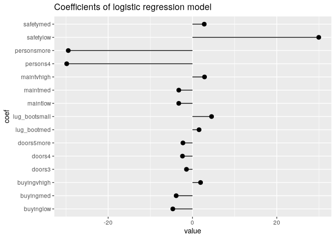
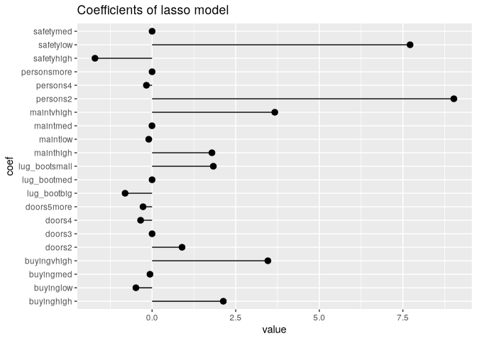
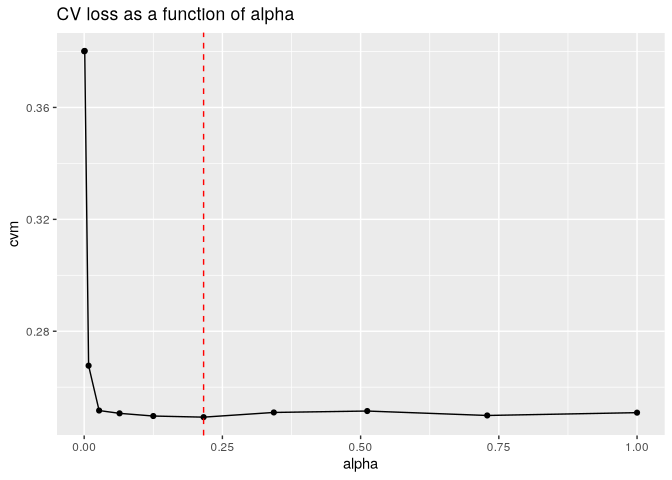

# Regularization


``` r
library(data.table)
```

Overly large coefficient magnitudes and standard errors can indicate
collinear variables in linear or logistic regression, or separation or
quasi-separation in a logistic model.

# Quasi-separation example

## Data prep

For this example, you will use again use the car data from the UCI
Machine Learning Repository that you used in chapter 2. This dataset has
information on 1728 makes of auto, with the following variables:

- car_price—(vhigh, high, med, low)
- maint_price—(vhigh, high, med, low)
- doors—(2, 3, 4, 5, more)
- persons—(2, 4, more)
- lug_boot —(small, med, big)
- safety—(low, med, high)

Target variable is rating (vgood, good, acc, unacc)

``` r
cars <- fread("repo-clone/UCICar/car.data.csv", header = T, stringsAsFactors = T)
vars <- setdiff(colnames(cars), "rating")

cars$fail <- cars$rating == "unacc"
outcome <- "fail"
```

``` r
set.seed(24351)
gp <- runif(nrow(cars))
library(zeallot)
c(cars_test, cars_train) %<-% split(cars, gp < 0.7)
nrow(cars_test); nrow(cars_train)
```

    [1] 499

    [1] 1229

## Logistic regression model

``` r
( fmla <- wrapr::mk_formula(outcome, vars) )
```

    fail ~ buying + maint + doors + persons + lug_boot + safety
    <environment: base>

``` r
model_glm <- glm(fmla, data = cars_train, family = binomial)
```

    Warning: glm.fit: fitted probabilities numerically 0 or 1 occurred

The error indicates the problem is quasi-seperable, that some set of
variables perfectly predicts a subset of the data.

``` r
summary(model_glm)
```


    Call:
    glm(formula = fmla, family = binomial, data = cars_train)

    Coefficients:
                   Estimate Std. Error z value Pr(>|z|)    
    (Intercept)     28.0132  1506.0310   0.019 0.985160    
    buyinglow       -4.6616     0.6520  -7.150 8.67e-13 ***
    buyingmed       -3.8689     0.5945  -6.508 7.63e-11 ***
    buyingvhigh      1.9139     0.4318   4.433 9.30e-06 ***
    maintlow        -3.2542     0.5423  -6.001 1.96e-09 ***
    maintmed        -3.2458     0.5503  -5.899 3.66e-09 ***
    maintvhigh       2.8556     0.4865   5.869 4.38e-09 ***
    doors3          -1.4281     0.4638  -3.079 0.002077 ** 
    doors4          -2.3733     0.4973  -4.773 1.82e-06 ***
    doors5more      -2.2652     0.5090  -4.450 8.58e-06 ***
    persons4       -29.8240  1506.0310  -0.020 0.984201    
    personsmore    -29.4551  1506.0310  -0.020 0.984396    
    lug_bootmed      1.5608     0.4529   3.446 0.000568 ***
    lug_bootsmall    4.5238     0.5721   7.908 2.62e-15 ***
    safetylow       29.9415  1569.3789   0.019 0.984778    
    safetymed        2.7884     0.4134   6.745 1.53e-11 ***
    ---
    Signif. codes:  0 '***' 0.001 '**' 0.01 '*' 0.05 '.' 0.1 ' ' 1

    (Dispersion parameter for binomial family taken to be 1)

        Null deviance: 1484.7  on 1228  degrees of freedom
    Residual deviance:  245.5  on 1213  degrees of freedom
    AIC: 277.5

    Number of Fisher Scoring iterations: 21

Three variables have extremely large coefficients and standard errors.
The number of iterations is unusually high.

``` r
coefs <- coef(model_glm)[-1]
coef_df <- data.frame(coef = names(coefs),
                      value = coefs)

library(ggplot2)
ggplot(coef_df, aes(x = coef, y = value)) +
  geom_pointrange(aes(ymin = 0, ymax = value)) +
  ggtitle("Coefficients of logistic regression model") +
  coord_flip()
```



Model’s test performance

``` r
cars_test$pred_glm <- predict(model_glm, newdata = cars_test, type = "response")
confmat <- function(df, predvar) {
  cmat <- table(truth = ifelse(df$fail > 0.5, "unacceptable", "passed"),
                prediction = ifelse(df[[predvar]] > 0.5, "unacceptable", "passed"))
  accuracy <- sum(diag(cmat)) / sum(cmat)
  deviance <- sigr::calcDeviance(df[[predvar]], df$fail)
  list(confusion_matrix = cmat,
       accuracy = accuracy,
       deviance = deviance)
}
confmat(cars_test, "pred_glm")
```

    $confusion_matrix
                  prediction
    truth          passed unacceptable
      passed          150            9
      unacceptable     17          323

    $accuracy
    [1] 0.9478958

    $deviance
    [1] 97.14902

The model appears to be good, but the large coefficients make it
untrustworthy. Regularization penalizes large coefficients and biases
them to 0.

# Types of regularized regression

- Ridge (L2): minimize prediction error while minimizing the sum of
  squared magnitudes of the coefficients

$$(y - f(x))^2 + \lambda * (b[1]^2 + ...
 + b[n]^2)$$

With lambda \>= 0

- Lasso (L1): minimize training prediction error while minimizing the
  sum of the absolute value of the coefficients

$$(y - f(x))^2 + \lambda * ( abs(b[1]) + abs(b[2]) + .... abs(b[n]) )$$

- Elastic Net: combination of both

$$(1 - \alpha) * (b[1]^2 + ... + b[n]^2) +
\alpha * ( abs(b[1]) + abs(b[2]) + .... abs(b[n]) )$$

When alpha = 0, this reduces to ridge regression; when alpha = 1, it
reduces to lasso.

# Regularized regression with glmnet

## Ridge regression

``` r
library(glmnet)
library(glmnetUtils)

( model_ridge <- cv.glmnet(fmla, cars_train, 
                           alpha = 0, family = "binomial") )
```

    Call:
    cv.glmnet.formula(formula = fmla, data = cars_train, alpha = 0, 
        family = "binomial")

    Model fitting options:
        Sparse model matrix: FALSE
        Use model.frame: FALSE
        Number of crossvalidation folds: 10
        Alpha: 0
        Deviance-minimizing lambda: 0.02070555  (+1 SE): 0.02272432

When predicting on the model, it uses the +1SE model by default as it is
less likely to be overfit than the lambda minimum.

``` r
( coefs <- coef(model_ridge) )
```

    22 x 1 sparse Matrix of class "dgCMatrix"
                   lambda.1se
    (Intercept)    2.07036884
    buyinghigh     0.36087302
    buyinglow     -0.79254704
    buyingmed     -0.65142106
    buyingvhigh    1.09666271
    mainthigh      0.19759816
    maintlow      -0.74515941
    maintmed      -0.62369242
    maintvhigh     1.17974675
    doors2         0.39060689
    doors3         0.01157841
    doors4        -0.22310921
    doors5more    -0.18460776
    persons2       2.70267399
    persons4      -1.40286591
    personsmore   -1.30448195
    lug_bootbig   -0.54140935
    lug_bootmed   -0.19315198
    lug_bootsmall  0.70910326
    safetyhigh    -1.75604427
    safetylow      2.63014096
    safetymed     -0.86745196

``` r
( coefs_min <- coef(model_ridge, s = model_ridge$lambda.min) )
```

    22 x 1 sparse Matrix of class "dgCMatrix"
                  s=0.02070555
    (Intercept)     2.13137491
    buyinghigh      0.37665185
    buyinglow      -0.82163733
    buyingmed      -0.67544647
    buyingvhigh     1.13444705
    mainthigh       0.20654314
    maintlow       -0.76927252
    maintmed       -0.64793654
    maintvhigh      1.21951127
    doors2          0.40566685
    doors3          0.01251643
    doors4         -0.23096450
    doors5more     -0.19286140
    persons2        2.79635254
    persons4       -1.45180862
    personsmore    -1.34899209
    lug_bootbig    -0.56143439
    lug_bootmed    -0.19960503
    lug_bootsmall   0.73451733
    safetyhigh     -1.81291214
    safetylow       2.71837393
    safetymed      -0.89853412

``` r
coefs - coefs_min
```

    22 x 1 sparse Matrix of class "dgCMatrix"
                     lambda.1se
    (Intercept)   -0.0610060682
    buyinghigh    -0.0157788252
    buyinglow      0.0290902998
    buyingmed      0.0240254090
    buyingvhigh   -0.0377843387
    mainthigh     -0.0089449765
    maintlow       0.0241131106
    maintmed       0.0242441264
    maintvhigh    -0.0397645261
    doors2        -0.0150599576
    doors3        -0.0009380169
    doors4         0.0078552862
    doors5more     0.0082536432
    persons2      -0.0936785547
    persons4       0.0489427101
    personsmore    0.0445101346
    lug_bootbig    0.0200250453
    lug_bootmed    0.0064530508
    lug_bootsmall -0.0254140666
    safetyhigh     0.0568678699
    safetylow     -0.0882329681
    safetymed      0.0310821580

``` r
coef_df <- data.frame(coef = rownames(coefs)[-1],
                      value = coefs[-1,1])

ggplot(coef_df, aes(x = coef, y = value)) +
  geom_pointrange(aes(ymin = 0, ymax = value)) +
  ggtitle("Coefficients of ridge model") +
  coord_flip()
```


Evaluate against test data

``` r
prediction <- predict(model_ridge, newdata = cars_test, type = "response")

cars_test$pred_ridge <- as.numeric(prediction)

confmat(cars_test, "pred_ridge")
```

    $confusion_matrix
                  prediction
    truth          passed unacceptable
      passed          148           11
      unacceptable     16          324

    $accuracy
    [1] 0.9458918

    $deviance
    [1] 187.2484

``` r
cars_test$pred_min <- as.numeric(
  predict(model_ridge, newdata = cars_test, type = "response",
          s = model_ridge$lambda.min)
)
confmat(cars_test, "pred_min")
```

    $confusion_matrix
                  prediction
    truth          passed unacceptable
      passed          148           11
      unacceptable     17          323

    $accuracy
    [1] 0.9438878

    $deviance
    [1] 182.752

## Lasso Regression

Same with alpha = 1.

``` r
( model_lasso <- cv.glmnet(fmla, cars_train, alpha = 1, family = "binomial") )
```

    Call:
    cv.glmnet.formula(formula = fmla, data = cars_train, alpha = 1, 
        family = "binomial")

    Model fitting options:
        Sparse model matrix: FALSE
        Use model.frame: FALSE
        Number of crossvalidation folds: 10
        Alpha: 1
        Deviance-minimizing lambda: 0.0003374489  (+1 SE): 0.00314706

``` r
( coefs_lasso <- coef(model_lasso) )
```

    22 x 1 sparse Matrix of class "dgCMatrix"
                    lambda.1se
    (Intercept)   -3.490572561
    buyinghigh     2.130073334
    buyinglow     -0.484316416
    buyingmed     -0.063502979
    buyingvhigh    3.462620673
    mainthigh      1.789611045
    maintlow      -0.100431987
    maintmed      -0.003575177
    maintvhigh     3.669603873
    doors2         0.895514081
    doors3         .          
    doors4        -0.343442599
    doors5more    -0.271136866
    persons2       9.024723234
    persons4      -0.170117582
    personsmore    .          
    lug_bootbig   -0.807448995
    lug_bootmed    .          
    lug_bootsmall  1.831519732
    safetyhigh    -1.708007733
    safetylow      7.714889117
    safetymed      .          

``` r
coef_df <- data.frame(coef = rownames(coefs_lasso)[-1],
                      value = coefs_lasso[-1,1])

ggplot(coef_df, aes(x = coef, y = value)) +
  geom_pointrange(aes(ymin = 0, ymax = value)) +
  ggtitle("Coefficients of lasso model") +
  coord_flip()
```



Still large coefficients but some are zeroed out.

``` r
cars_test$pred_lasso <- as.numeric(
  predict(model_lasso, newdata = cars_test, type = "response",
          s = model_lasso$lambda.min)
)
confmat(cars_test, "pred_lasso")
```

    $confusion_matrix
                  prediction
    truth          passed unacceptable
      passed          150            9
      unacceptable     17          323

    $accuracy
    [1] 0.9478958

    $deviance
    [1] 98.30666

Same accuracy as ridge, but much lower deviance.

## Elastic Net `cva.glmnet()`

``` r
( elastic_net <- cva.glmnet(fmla, cars_train, family = "binomial") )
```

    Call:
    cva.glmnet.formula(formula = fmla, data = cars_train, family = "binomial")

    Model fitting options:
        Sparse model matrix: FALSE
        Use model.frame: FALSE
        Alpha values: 0 0.001 0.008 0.027 0.064 0.125 0.216 0.343 0.512 0.729 1
        Number of crossvalidation folds for lambda: 10

`net$aplha` contains all the alphas tested, and `net$modlist` contains
the corresponding models.

``` r
elastic_net$alpha
```

     [1] 0.000 0.001 0.008 0.027 0.064 0.125 0.216 0.343 0.512 0.729 1.000

``` r
elastic_net$modlist[[1]]
```


    Call:  glmnet::cv.glmnet(x = x, y = y, weights = ..1, offset = ..2,      nfolds = nfolds, foldid = foldid, alpha = a, family = "binomial") 

    Measure: Binomial Deviance 

         Lambda Index Measure      SE Nonzero
    min 0.02071   100  0.3718 0.01346      21
    1se 0.02272    99  0.3801 0.01337      21

``` r
get_cvm <- function(model) {
  index <- match(model$lambda.1se, model$lambda)
  model$cvm[index]
}

enet_performance <- data.frame(alpha = elastic_net$alpha)
models <- elastic_net$modlist
enet_performance$cvm <- vapply(models, get_cvm, numeric(1))
enet_performance
```

       alpha       cvm
    1  0.000 0.3800907
    2  0.001 0.3802087
    3  0.008 0.2676905
    4  0.027 0.2516512
    5  0.064 0.2506523
    6  0.125 0.2496900
    7  0.216 0.2492874
    8  0.343 0.2509695
    9  0.512 0.2514734
    10 0.729 0.2498885
    11 1.000 0.2508947

``` r
minix <- which.min(enet_performance$cvm)
( best_alpha <- elastic_net$alpha[minix] )
```

    [1] 0.216

``` r
ggplot(enet_performance, aes(x = alpha, y = cvm)) +
  geom_point() +
  geom_line() +
  geom_vline(xintercept = best_alpha, color = "red", linetype = 2) +
  ggtitle("CV loss as a function of alpha")
```



It is recommended to run this multiple times and average the results.

``` r
( model_enet <- cv.glmnet(fmla, cars_train,
                          alpha = best_alpha, family = "binomial") )
```

    Call:
    cv.glmnet.formula(formula = fmla, data = cars_train, alpha = best_alpha, 
        family = "binomial")

    Model fitting options:
        Sparse model matrix: FALSE
        Use model.frame: FALSE
        Number of crossvalidation folds: 10
        Alpha: 0.216
        Deviance-minimizing lambda: 0.000183849  (+1 SE): 0.002487565

``` r
cars_test$pred_enet <- as.numeric(
  predict(model_enet, newdata = cars_test, type = "response")
)
confmat(cars_test, "pred_enet")
```

    $confusion_matrix
                  prediction
    truth          passed unacceptable
      passed          149           10
      unacceptable     17          323

    $accuracy
    [1] 0.9458918

    $deviance
    [1] 117.6531
